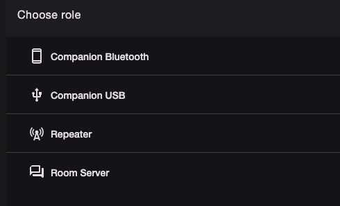
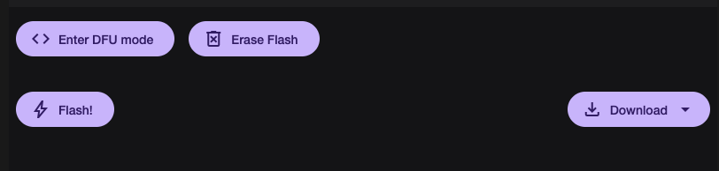
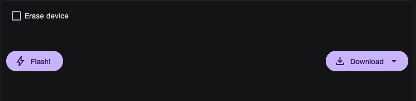
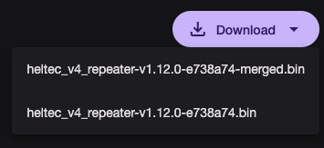
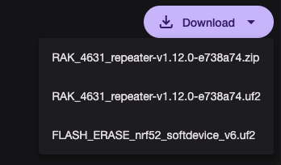

# Flashing Devices

To flash your device with MeshCore firmware, you'll use the **MeshCore Web Flasher**. This web-based tool makes it easy to install the firmware on compatible devices.

## Access the Web Flasher

Start by navigating to the [MeshCore Web Flasher](https://flasher.meshcore.co.uk/).

## Step 1: Select Your Device

Once you're on the flasher page, you'll see a list of supported devices. **Select the device you want to flash** from the available options.

## Step 2: Choose Device Role

After selecting your device, you need to **choose a device role** for your device. The device role determines how your device will function on the mesh network.

Select the appropriate role based on your intended use case:
| Role | Description |
|---|---|
| **Companion Bluetooth** | Most common chat client node that pairs with your phone via bluetooth |
| **Companion USB** | Chat client node that connects to a computer via USB (bluetooth not enabled) |
| **Repeater** | Infrastructure node that extends network range by relaying messages between mesh nodes |
| **Room Server** | Node that acts as a bulletin board to store messages (can also be used as a repeater) |

## Step 3: Erase and Flash or Download

**Erase**: Use this option if your device is brand new, or this is the first time flashing MeshCore to your device

You need to set your device into DFU mode first. You can click on the `Enter DFU Mode` button (if available), or use the buttons on your device to enter DFU mode (i.e. double clicking the reset button on RAKs or holding down PRG while pushing RST on Heltecs)

If you just want to download the firmware, click on the download button:

Bin and Zip files can be used on the web flasher or via OTA methods.
Uf2 files are used for drag and drop onto device volume.
Files labels with `merged` will erase and flash the firmware onto devices. Files without `merged` (unmerged) will not erase and just flash the firmware onto devices.

## Notes

- The only firmware that supports Bluetooth (for use with smartphone apps) is **Companion Bluetooth**
- The default pairing pin is either shown on the screen or `123456`
- Make sure your device is properly connected and in the correct mode before starting the flashing process

## Next Steps

Now that your device is flashed, choose your next step based on the device role you selected:

- **Repeater or Room Server**: [Set up your repeater or room server](./setting-up-repeater.md)
