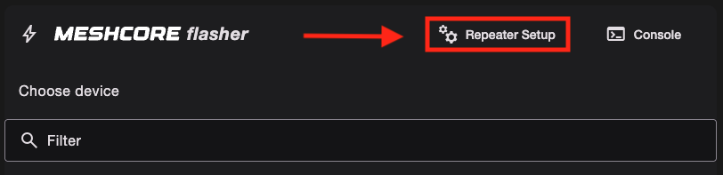
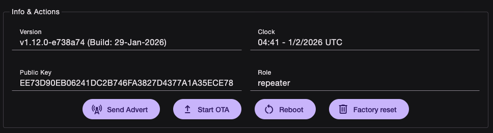
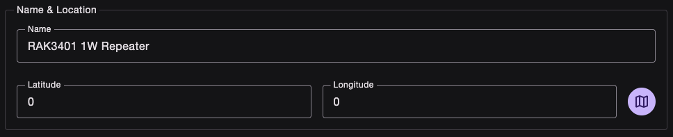
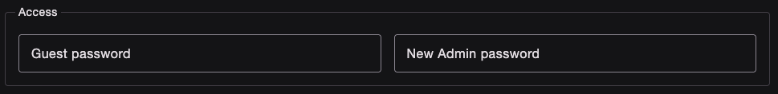
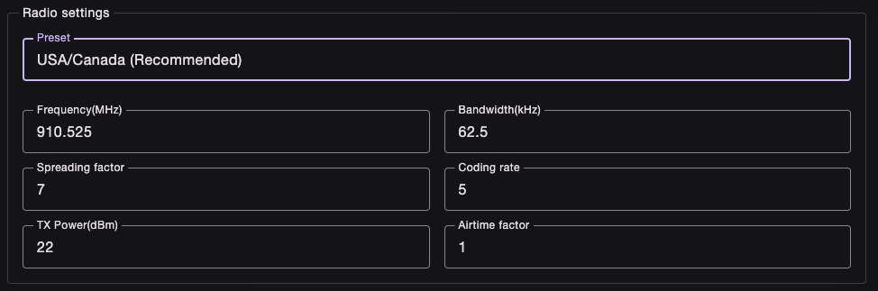
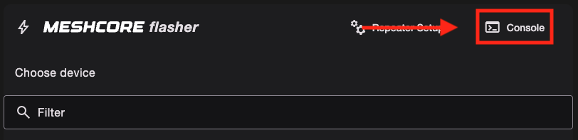

# Setting Up Repeaters/Room Servers

After flashing your device with the Repeater or Room Server firmware, you'll need to configure it before it can join your mesh network. This guide will walk you through the setup process.

## Access the Configuration Portal

Once your device is flashed, you have two ways to access the configuration portal:

1. **Navigate directly**: Go to [config.meshcore.dev](https://config.meshcore.dev)
2. **From the flasher page**: Click on the **Repeater Setup** button on the MeshCore Web Flasher page

## Repeater Information

The top section is the **Repeater Information**. This displays important details about your repeater device.

Look at the public key. The first 2 characters (1st byte or hex prefix) is what will be used as for the path in packets. If your prefix collides with a another repeater, we kindly ask to [change you key](../how-to-change-keys.md). Please visit our [Discord](https://discord.gg/wcmesh) to get set up with a new key.

|Button|Description|
|---|---|
|Send Advert|Sends a flood advert of your repeater's name, public key, and location across the mesh. |
|Start OTA|Can be used to upgrade firmware without the flasher|
|Reboot|Reboots device|
|Factory Reset|Erases device. Restores factory defaults|

## Name and Location

Next, you'll configure the **Name and Location** for your repeater. This helps you identify and manage your repeater on the mesh.

Enter a descriptive name and location for your repeater. You can use the map button to select a location on the world map. This information will be visible on the mesh.

## Password

Set up a **password** for your repeater to secure access to its configuration.

The guest password allows users to log in to see your repeater stats. They will not be able to control your repeater. For room servers, this allows users to log in to see/leave messages. Leave blank if you want anyone to access it.

The admin password allows users to log in and control your repeater or room server. Choose a strong password that you'll remember. This is the password you will be using to access your repeater to edit its configuration.

## Radio Settings

Finally, configure the **Radio Settings** for your repeater. This is how your repeater will get on the mesh.

Adjust the settings according to your network region. Not everyone uses the US Defaults. Here's a list of freqencies used my West Coast Mesh regions:
|Region|Frequency|Bandwidth|Spreading Factor|Coding Rate*|
|---|---|---|---|---|
|SoCal|927.875|62.5|7|5|
|Bay Area (default)|910.525|62.5|7|5|
|Sacramento-Foothills|909.875|62.5|9|5|
|Central Valley (default)|910.525|62.5|7|5|
|Pacific Northwest (default)|910.525|62.5|7|5|

**Coding Rate* is per device specific. You can be on a different coding rate and still reach the mesh. Every other parameter has to match.

Some devices have an amp, so the TX power needs to be set accordingly. [Here](../device-tx-limits.md) is a list of devices with amps.

## Console Access

If you need to access the console for advanced configuration or troubleshooting, you can use the console interface:

The console provides direct access to your repeater's command interface for advanced operations. Type a command, like 'set prv.key', next to the prompt.

A list of repeater/room server commands can be found [here](../cli-reference.md). These commands can also be used via remote access.

## Next Steps

Once you've completed the configuration:
- Review your settings and click `Save settings`
- Click on `Send Advert` so others can see your node.
- It will begin relaying messages between mesh nodes (if configured as a Repeater)
- It will store messages for retrieval (if configured as a Room Server)
- You can manage and monitor it through the configuration portal
- If you ever reboot your device, you need to sync the clock. Refer to CLI commands.