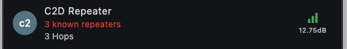
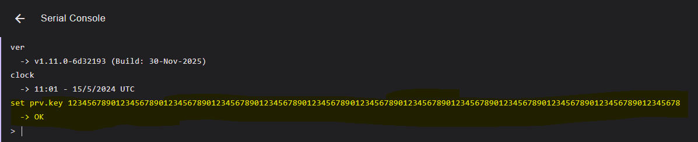

# How to Change Keys

Repeaters use the first two characters (one byte in hex) of its public key to show in the path that it repeated the packet. If two or more repeaters share the same prefix, it is hard to trace which repeater repeated the message and will show as "X known repeaters" if they are in your contacts.

To avoid collisions, we kindly ask repeater owners to change keys.

## Finding open prefixes

The quickest way to find an open prefix is to use MeshBuddy on Discord.

Go to the appropriate #repeater-control channel for your region:

- **SoCal**: [SoCal Repeater Control](https://discord.com/channels/1350515855942881442/1424049467241402531)
- **Bay Area**: [Bay Area Repeater Control](https://discord.com/channels/1350515855942881442/1442733640705376437)
- **Sacramento-Foothills**: [Sacramento-Foothills Repeater Control](https://discord.com/channels/1350515855942881442/1442733667062648934)
- **Central Valley**: [Central Valley Repeater Control](https://discord.com/channels/1350515855942881442/1454500129628487784)

:::info
ALL PREFIXES IN SOCAL HAVE BEEN TAKEN. WE ARE WORKING ON A NEW SOLUTION
:::

Run the `/open` command to find an open 2 character prefix (1 byte) for your new key.

Run the `/prefix` or `/stats` command to check if another device is using the prefix you want.

## Generating a new key

Generate your private key by using the `/keygen` command in the #repeater-control channel and pass in your 2 character prefix.

Or

Navigate to the [MeshCore Key Generator](https://gessaman.com/mc-keygen/) and type in your prefix.

Copy or write down the ***PRIVATE*** key.

## Change your key

### For MeshCore firmware 1.11 and below

Connect your repeater to a PC via USB, use Chrome and go to the [web flasher](https://flasher.meshcore.dev/) and click on Console button to enter repeater console.

Type the command `set prv.key` followed by the private key you copied or wrote down from the previous step. Example: `set prv.key 12345678901234567890123456789012345678901234567890123456789012345678901234567890123456789012345678901234567890123456789012345678`

### For MeshCore firmware 1.12 and above

You can either do the same serial console instruction above, or you can log in to your repeater remotely to change the private key.

From your companion deivce, log in to your repeater using your admin password. Click on the Command Line tab and then paste the same `set prv.key` command with your generated private key.

## Other resources

There are additional instructions on the [MeshCore Key Generator site](https://gessaman.com/mc-keygen/instructions)