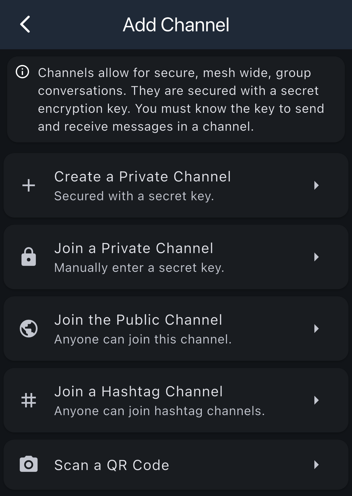
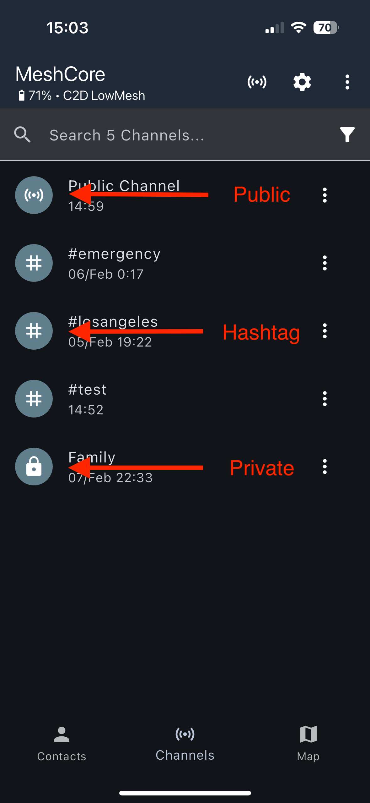
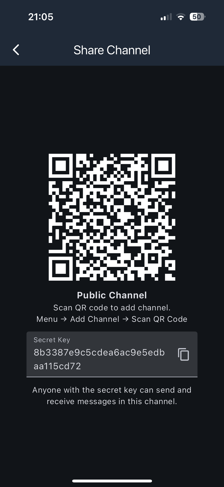
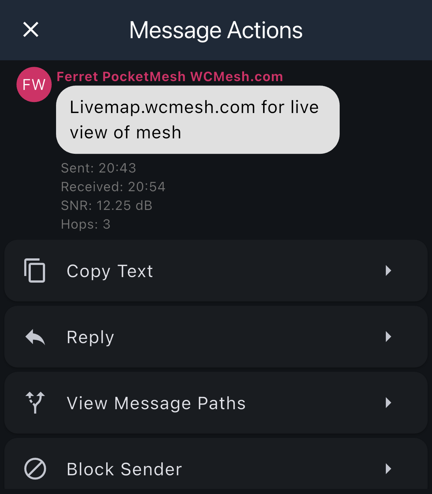
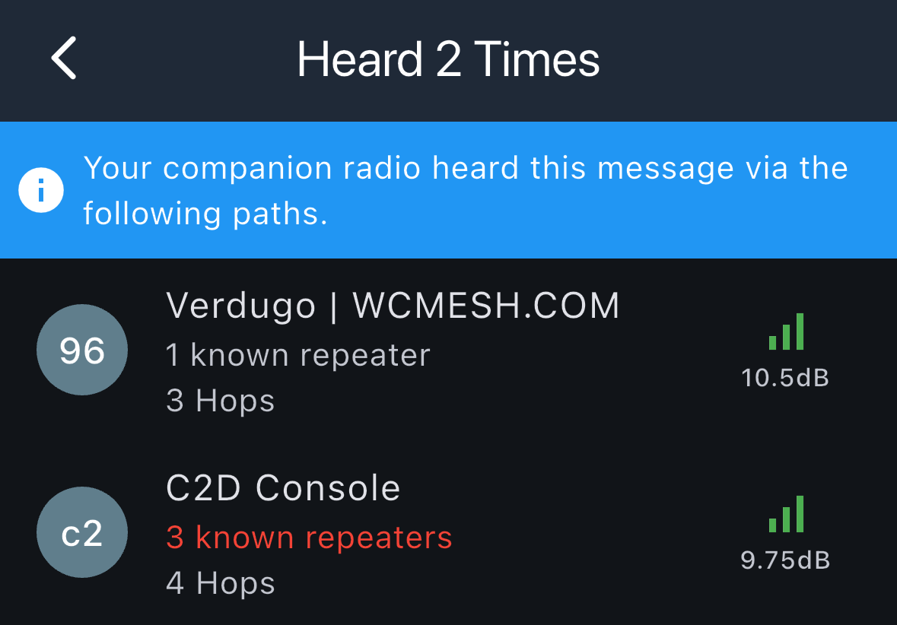
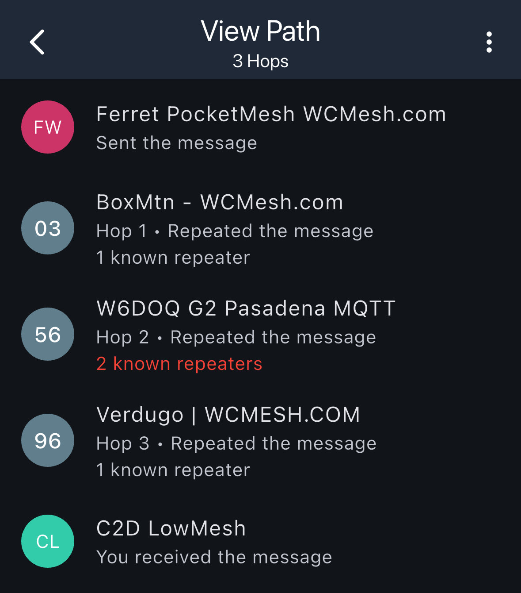
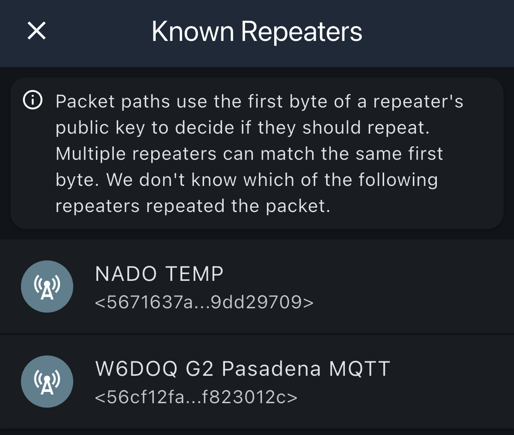

# Channels

Channels allow you to communicate with groups of users on the mesh network. You can join channels, create channels, send messages, and view message details including the path messages took through the network.

## Adding Channels

You can add channels to your device in several ways. To access the Add Channel screen, go to Menu → Add Channel.

### Channel Types

Channels allow for secure, mesh-wide, group conversations. They are secured with a secret encryption key. You must know the key to send and receive messages in a channel.

| Option | Description |
|--------|-------------|
| **Create a Private Channel** | Create a new private channel secured with a secret key |
| **Join a Private Channel** | Manually enter a secret key to join an existing private channel |
| **Join the Public Channel** | Join the public channel that anyone can access |
| **Join a Hashtag Channel** | Join a hashtag channel (anyone can join hashtag channels) |
| **Scan a QR Code** | Scan a QR code to join a channel shared by someone else |

## Channel List

The Channels screen displays all the channels you've joined or have created.

### Channel List Features

- **Search Bar**: Use the search bar at the top to quickly find channels by name
- **Channel Entries**:
  - **Icon**: Visual indicator showing the channel type (Public Channel uses network icon, hashtag channels use # symbol, private channels show a lock icon)
  - **Channel Name**: The name of the channel (e.g., "Public Channel", "#emergency", "#test")
  - **Last Activity**: Timestamp showing when the last message was received in the channel
  - **Notification**: Number of new messages since last time opened
  - **Menu Options** (⋮): Tap the three-dot menu on individual channels for more options
    | Option | Description |
    |---|---|
    | **Share** | Share the channel with others via QR code or secret key |
    | **Rename** | Change the channel name |
    | **Remove Channel** | Delete the channel from your device |
    | **Notifications** | Configure push notification settings ("All Messages", "Mentions Only", "None") |

## Sharing Channels

You can share channels with others so they can join and participate in the conversation.

### Sharing Options

- **QR Code**: A QR code is displayed that others can scan to join the channel
  - To scan: Menu → Add Channel → Scan QR Code
- **Secret Key**: A secret key is displayed that can be shared with others
  - Anyone with the secret key can send and receive messages in this channel
  - Tap the copy icon to copy the secret key to your clipboard

## Message Actions

When you receive a message in a channel, you can press and hold on it to view message actions and details.

### Message Information

Each message displays:
- **Sender**: The name of who sent the message
- **Message Content**: The text of the message
- **Sent Time**: When the message was originally sent
- **Received Time**: When you received the message
- **SNR**: Signal-to-Noise Ratio in dB
- **Hops**: Number of hops the message took through the network

### Available Actions

| Action | Description |
|---|---|
| **Copy Text** | Copy the message text to your clipboard |
| **Reply** | Reply to the message sender |
| **View Message Paths** | See detailed information about how the message traveled through the network |
| **Block Sender** | Block messages from this sender |

## Viewing Message Paths

When viewing message paths, you can see how many times your companion radio heard the message and through which paths.

### Path Information

For each path, you'll see:
- **Repeater Prefix**: The hex prefix of the repeater
- **Repeater Name**: The name of the repeater that relayed the message (if in your contacts)
- **Known Repeaters**: Number of known repeaters in your contacts
- **Hops**: Total number of hops the message took
- **Signal Strength**: SNR (Signal-to-Noise Ratio) in dB with a visual indicator

This information helps you understand the reliability and quality of different paths through the mesh network.

### Message Path

You can view the detailed path a message took through the mesh network, showing each hop from sender to receiver.

### Path Details

The path view shows:
- **Total Hops**: The number of intermediate steps the message took
- **Sender**: The origin of the message
- **Each Hop**:
  - **Repeater Prefix**: The hex prefix of the repeater
  - **Repeater Name**: The name of the repeater (if in your contacts)
  - **Hop Number**: Which hop in the sequence (Hop 1, Hop 2, etc.)
  - **Action**: "Repeated the message"
  - **Known Repeaters**: Number of known repeaters in your contacts
- **Receiver**: Your device that received the message

This visualization helps you understand how messages propagate through the mesh network and which repeaters are involved in routing.

### Known Repeaters

When viewing a hop in the message path, you can see which repeaters could have been involved in relaying the message.

## Important Note

Packet paths use the first byte of a repeater's public key to decide if they should repeat. Multiple repeaters can match the same first byte, so the system doesn't know which specific repeater handled the packet. The "Known Repeaters" list shows all repeaters that could have been involved in that hop if you have them in your contacts.
