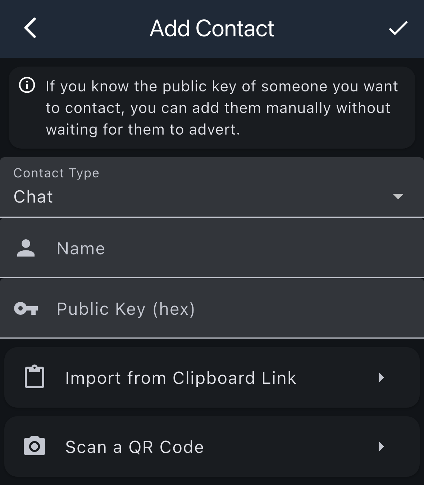
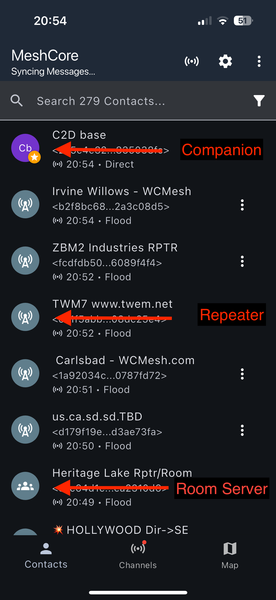
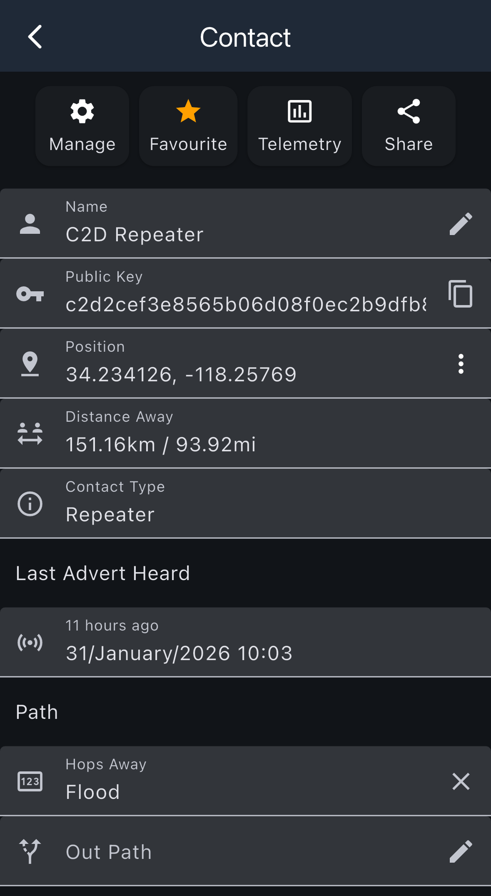
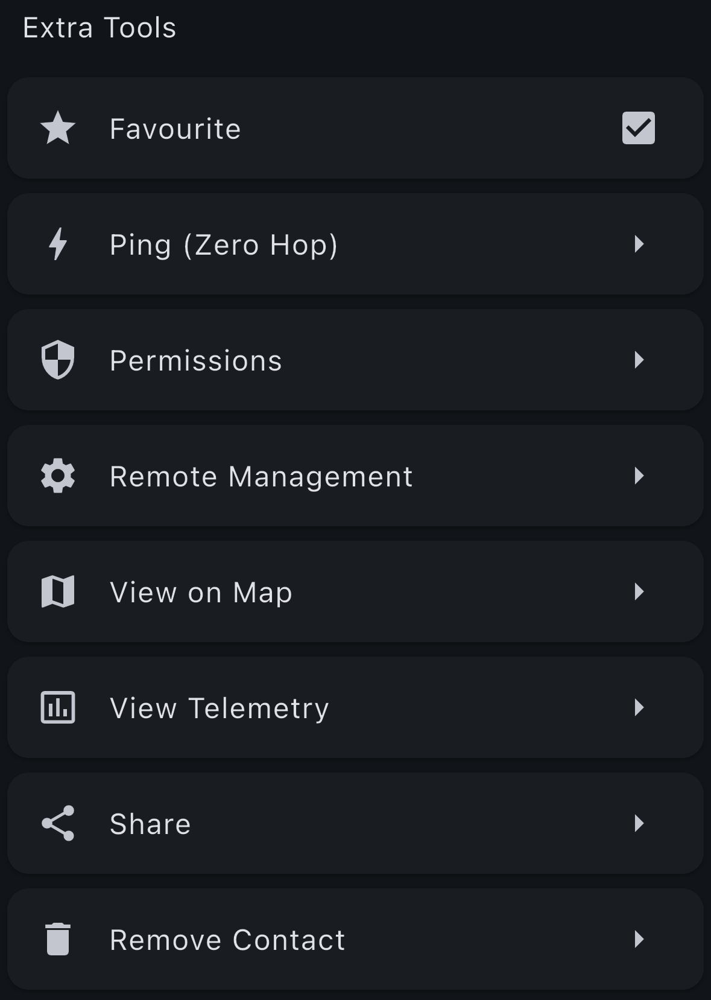

# Contacts

The main screen of the MeshCore app is your primary interface for viewing and managing contacts on the mesh network.

## Adding Contacts

You can add contacts to your device in several ways. To access the Add Contact screen, go to Menu → Add Contact.

### Manual Contact Entry

If you know the public key of someone you want to contact, you can add them manually without waiting for them to advert.

**Required Information:**
- **Contact Type**: Select the type of contact (Chat, Repeater, Room Server, etc.)
- **Name**: Enter a display name for the contact
- **Public Key (hex)**: Enter the contact's public key in hexadecimal format

After entering the information, tap the checkmark icon to save the contact.

### Alternative Methods

| Method | Description |
|--------|-------------|
| **Import from Clipboard Link** | Import contact information from a link copied to your clipboard |
| **Scan a QR Code** | Scan a QR code to add a contact (useful when someone shares their contact code) |

You can also discover contacts automatically by using the **Discover Contacts** option from the menu, which shows a list of nodes that have advertised on the mesh network.

## Contact List

The main area of the screen displays your contact list, showing all the companions, repeaters, and room servers you've added from the mesh network.

### Contact List Features

- **Search Bar**: Use the search bar at the top to quickly find contacts by name or public key
- **Contact Entries**:
  - **Icon**: Visual indicator showing the type of node (Companion, Repeater, Room Server)
  - **Name**: The display name of the contact
  - **Public Key**: The unique identifier (hex address) for the node
  - **Route Path**: Last known advert status showing timestamp and route path (Direct, Flood, X Hops)
  - **Menu Options** (⋮): Tap the three-dot menu on individual contacts for more options

### Companion Menu Options

|Button|Description|
|---|---|
| **Details** |Shows the companion details page|
| **Share** |Shows the share contact options|
| **Set Path** |Manually set a path to the node|
| **Reset Path** |Resets path to flood|
| **Remove Contact** |Deletes contact from device|
| **Favourite** |Adds node to favourite's list|

### Repeater/Room Server Menu Options

|Button|Description|
|---|---|
| **Details** |Shows the companion details page|
| **Share** |Shows the share contact options|
| **Set Path** |Manually set a path to the node|
| **Reset Path** |Resets path to flood|
| **Ping (Zero Hop)** |Pings repeater and returns SNR if in direct contact|
| **Remove Contact** |Deletes contact from device|
| **Favourite** |Adds node to favourite's list|

## Contact Details

When you tap the three-dot menu (⋮) next to a contact and select **Details**, you'll see a detailed view of the contact's information.

### Action Buttons

At the top of the contact details screen, you'll find four action buttons:

| Button | Description |
|--------|-------------|
| **Manage** | Access management options for the contact |
| **Favourite** | Add or remove the contact from your favourites list (yellow star indicates favorited) |
| **Telemetry** | View telemetry data from the contact (if available) |
| **Share** | Share the contact information with others |

### Contact Information

The main section displays detailed information about the contact:

- **Name**: The display name of the contact (tap the pencil icon to edit)
- **Public Key**: The contact's unique public key identifier (tap the copy icon to copy to clipboard)
- **Position**: GPS coordinates (latitude, longitude) if the contact shares their position
- **Distance Away**: Calculated distance to the contact in kilometers and miles
- **Contact Type**: The type of node (Companion, Repeater, Room Server, etc.)

### Last Advert Heard

This section shows when you last received an advert from this contact:
- **Time**: How long ago the advert was heard (e.g., "11 hours ago")
- **Date and Time**: The exact date and time the advert was received

### Path Information

The Path section displays routing information:

- **Hops Away**: Shows how many hops away the contact is, or "Flood" if using flood routing. You can clear the path by tapping the X icon.
- **Out Path**: The configured path for sending messages to this contact. Tap the pencil icon to manually set or edit the path.

## Contact Tools

From the contact details screen, you can access additional tools by tapping the **Manage** button. This opens the Extra Tools menu with various options for managing the contact.

### Available Tools

| Tool | Description |
|------|-------------|
| **Favourite** | Add or remove the contact from your favourites list (checkbox indicates if currently favourited) |
| **Ping (Zero Hop)** (Repeater Only) | Ping the contact and get SNR (Signal-to-Noise Ratio) if in direct contact |
| **Send a Message** (Companion Only) | Send a direct message to the contact |
| **Permissions** | Configure permissions for this contact |
| **Remote Management** (Repeater only) | Access remote management options for the contact |
| **View on Map** | View the contact's location on a map |
| **View Telemetry** | View telemetry data from the contact |
| **Share** | Share the contact information with others |
| **Remove Contact** | Delete the contact from your device |

These tools provide additional functionality for managing and interacting with your contacts beyond the basic contact information displayed on the details screen.
