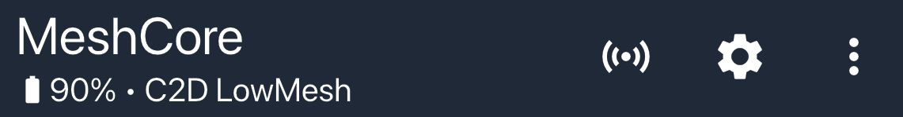

# MeshCore App

The MeshCore App is the official mobile application for connecting to and managing your MeshCore companion device. It provides a user-friendly interface for communicating over the mesh network, managing contacts and channels, accessing repeaters, and monitoring your device status—all from your smartphone.

## Getting Started

To use the MeshCore App, you'll need:

1. **A Companion Bluetooth device** flashed with MeshCore firmware
2. **The MeshCore App** installed on your smartphone
3. **Bluetooth pairing** between your phone and device (default PIN is usually `123456` or as shown on the device screen)

Once connected, you can start chatting, adding contacts, and exploring the mesh network.

## App Interface Overview

### Header

The header section at the top of the screen displays important information and menu options:

- **Status Information**: Below the title, you'll see battery level and your device name
- **Icons** (from left to right):
  - **Advert**: Select how to send an advert.
    |Button|Description|
    |---|---|
    | **Advert Zero Hop** |Sends an advert to all local, direct nodes.|
    | **Advert Flood Routed** |Sends an advert to all nodes on the mesh.|
    | **Advert To Clipboad** |Saves your contact info to the clipboad.|
  - **Settings Icon** (⚙️): Tap this to access the [Settings](settings.md) screen.
  - **Menu Icon** (⋮): Opens additional options menu.
    |Button|Description|
    |---|---|
    | **Disconnect** |Disconnect from your device.|
    | **Add Contact** |Add a new contact to your device.|
    | **Add Channel** |Add a new channel to your device.|
    | **Discover Contacts** |Shows list of nodes that have adverted on the mesh. Can add nodes to contact list.|
    | **My Contact Code** |Displays a QR code for others to scan.|
    | **Internet Map** |Displays the internet map showing all the MeshCore nodes over the world.|
    | **Tools** |List of tools available within the MeshCore app.|
    | **About MeshCore** |Displays infornation about MeshCore, the firmware, and the app.|

### Tab Bar

The tab bar at the bottom of the screen displays navigation information:

- **Contacts**: Displays list of contacts saved on your device
- **Channels**: Displays list of channels saved on your device
- **Map**: Displays a map of locations of your saved contacts