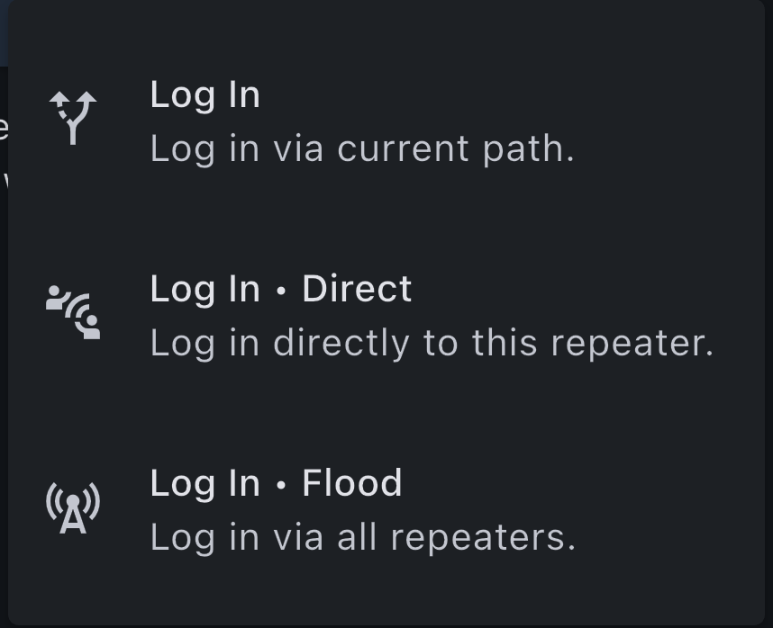
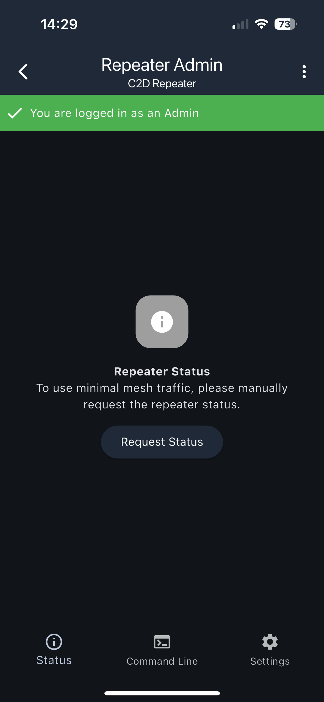
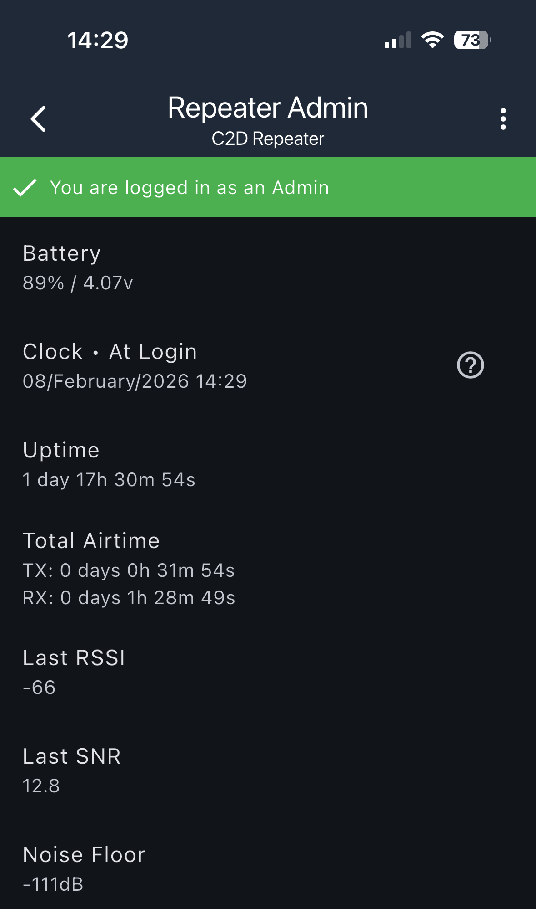
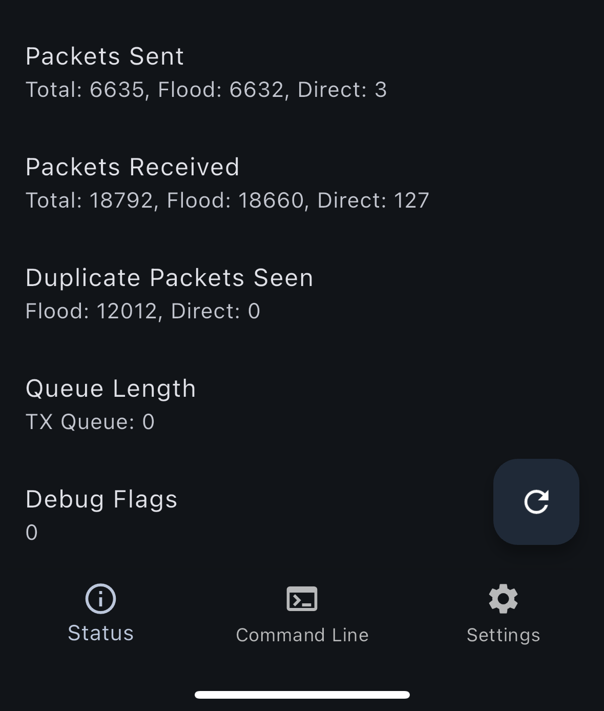
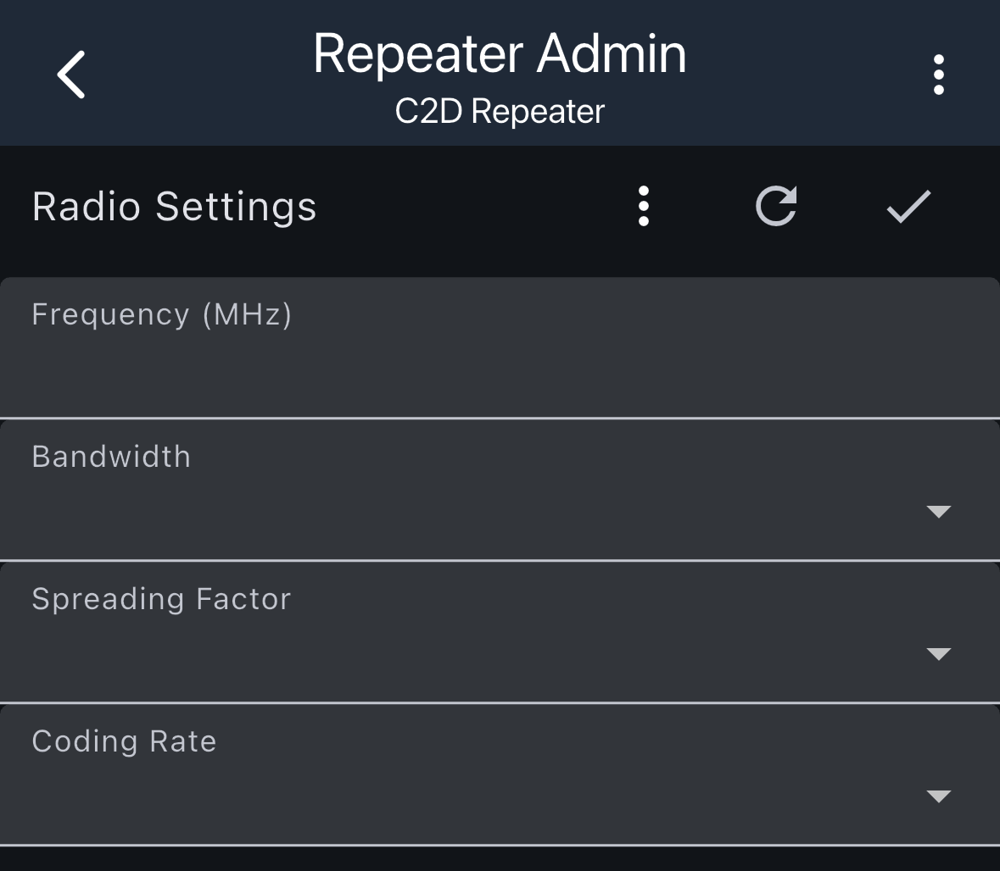
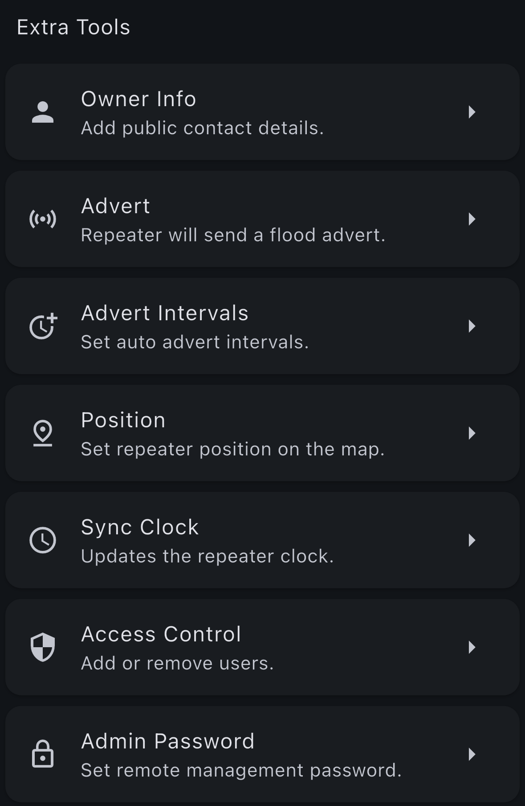
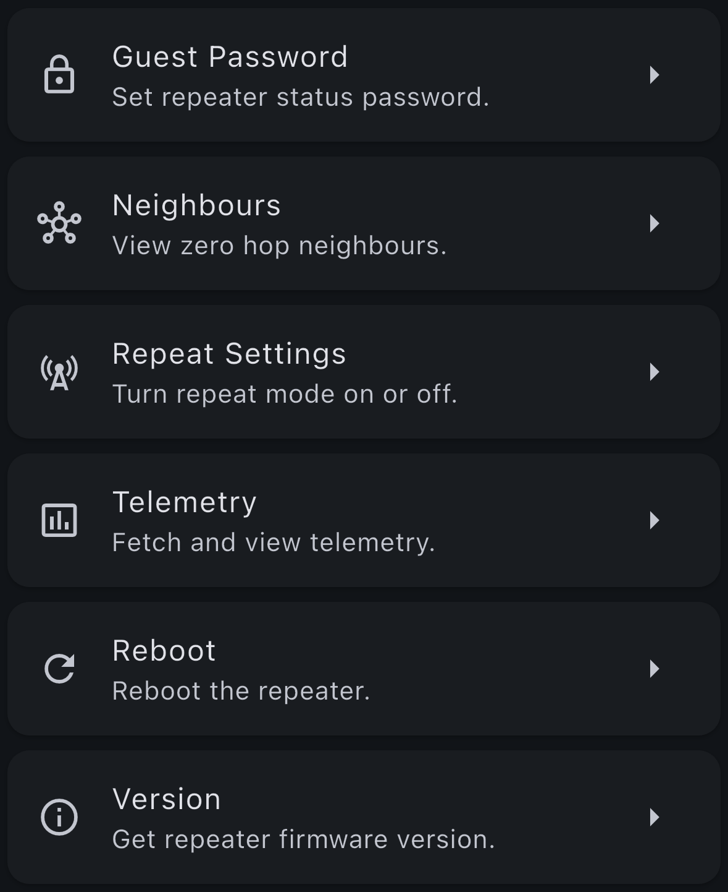
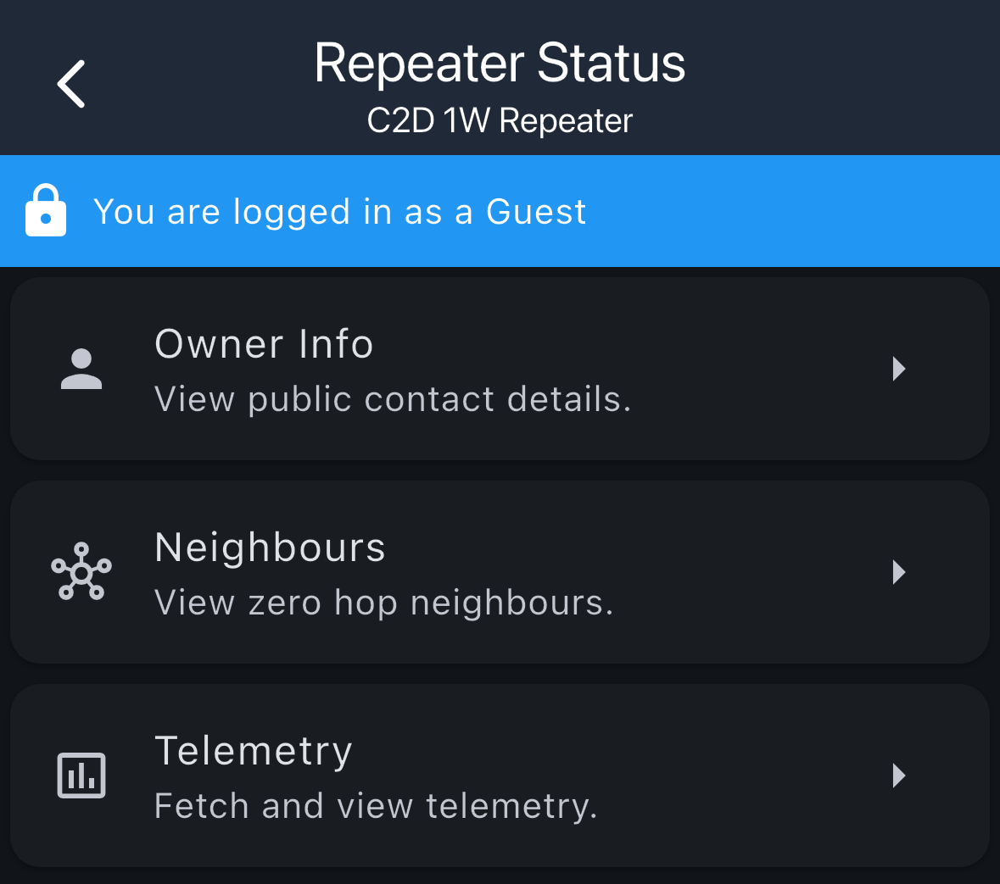

# Repeater Access

When you access a repeater from your contact list, you can view details, manage settings, and perform administrative tasks. The level of access depends on whether you log in as an Admin or Guest.

## Logging In

Before accessing repeater details, you need to log in to the repeater. There are three login methods available:

| Login Method | Description |
|--------------|-------------|
| **Log In** | Log in via current path. Uses the existing connection path to the repeater. |
| **Log In • Direct** | Log in directly to this repeater. Establishes a direct connection without routing through other repeaters. |
| **Log In • Flood** | Log in via all repeaters. Broadcasts the login request through the entire mesh network. |

## Repeater Admin Home

After logging in as an Admin, you'll see the Repeater Admin home screen.

### Admin Status

When logged in as an Admin, a green banner at the top confirms "You are logged in as an Admin" with a checkmark icon.

### Repeater Status

The main screen displays the Repeater Status section. To minimize mesh traffic, you need to manually request the repeater status by tapping the "Request Status" button.

### Navigation

The bottom navigation bar provides access to three main sections:
- **Status**: View repeater statistics and status information
- **Command Line**: Access the command line interface
- **Settings**: Configure repeater settings

## Repeater Statistics

The Status screen displays detailed statistics about the repeater's operation and performance.

### Basic Statistics

- **Battery**: Current battery level and voltage (e.g., "89% / 4.07v")
- **Clock • At Login**: Date and time when you logged in
- **Uptime**: How long the repeater has been running (e.g., "1 day 17h 30m 54s")
- **Total Airtime**:
  - **TX**: Total transmit time
  - **RX**: Total receive time
- **Last RSSI**: Last received signal strength indicator
- **Last SNR**: Last signal-to-noise ratio
- **Noise Floor**: Current noise floor level in dB
- **Packets Sent**: Total packets sent, broken down by Flood and Direct
- **Packets Received**: Total packets received, broken down by Flood and Direct
- **Duplicate Packets Seen**: Number of duplicate packets detected (Flood and Direct)
- **Queue Length**: Current TX queue length
- **Debug Flags**: Current debug flag values

You can refresh the statistics using the refresh button (circular arrow icon) to get the latest data.

## Radio Settings

The Radio Settings screen allows you to configure the repeater's radio parameters. Again, to minimize mesh traffic, you need to request this info from the repeater by pressing the circle arrow icon.

### Available Settings

- **Frequency (MHz)**: Set the operating frequency
- **Bandwidth**: Configure the bandwidth
- **Spreading Factor**: Adjust the spreading factor
- **Coding Rate**: Set the coding rate

Each setting can be modified by tapping on it and selecting from available options. Make sure you hit the checkmark to save your settings. Will require a reboot to actually save the settings on the repeater.

## Admin Tools

When logged in as an Admin, you have access to additional management tools.

### Available Admin Tools

| Tool | Description |
|------|-------------|
| **Owner Info** | Add public contact details that will be visible to others |
| **Advert** | Repeater will send a flood advert to announce its presence |
| **Advert Intervals** | Set auto advert intervals for automatic periodic advertisements |
| **Position** | Set repeater position on the map |
| **Sync Clock** | Updates the repeater clock to synchronize with your companion time (can only go forward, not backward) |
| **Access Control** | Add or remove users who can access the repeater |
| **Admin Password** | Set remote management password for admin access |
| **Guest Password** | Set repeater password for guest access |
| **Neighbours** | View zero hop neighbours (directly connected nodes) |
| **Repeat Settings** | Turn repeat mode on or off |
| **Telemetry** | Fetch and view telemetry data from the repeater |
| **Reboot** | Reboot the repeater |
| **Version** | Get repeater firmware version information |

## Guest Tools

When logged in as a Guest, you have limited access to view information and perform basic operations.

### Available Guest Tools

| Tool | Description |
|------|-------------|
| **Owner Info** | View public contact details from the repeater |
| **Neighbours** | View zero hop neighbours (directly connected nodes) |
| **Telemetry** | Fetch and view telemetry data from the repeater |
