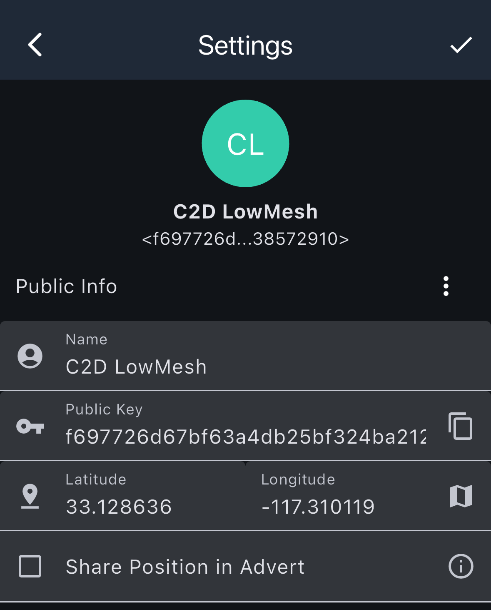
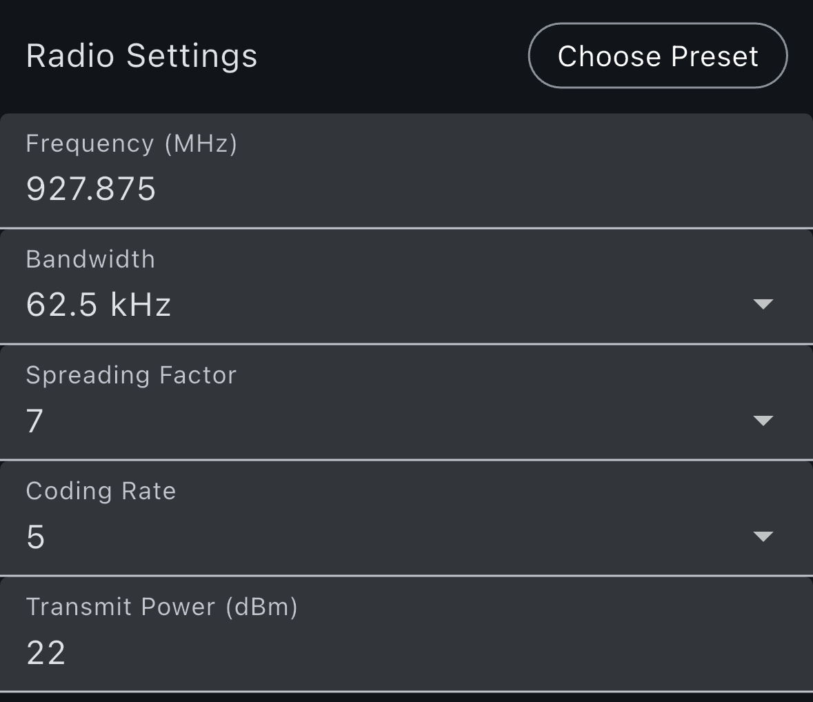
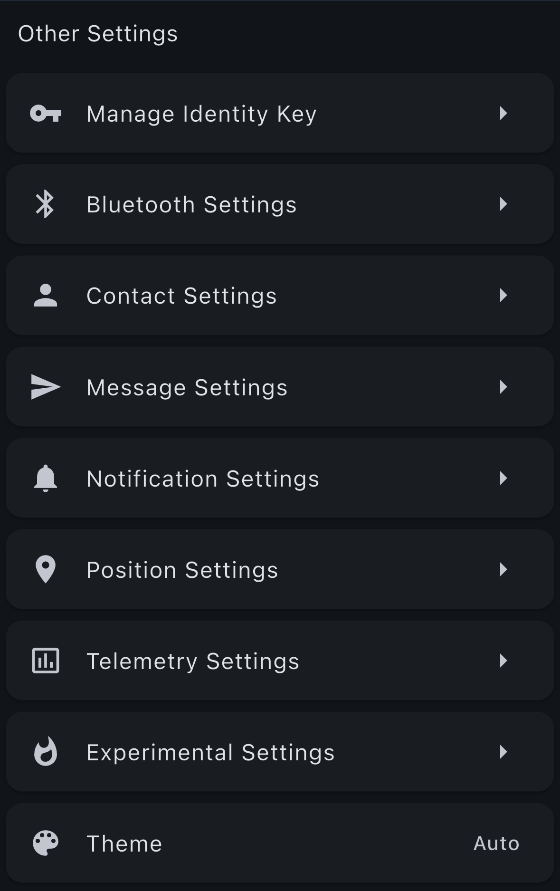
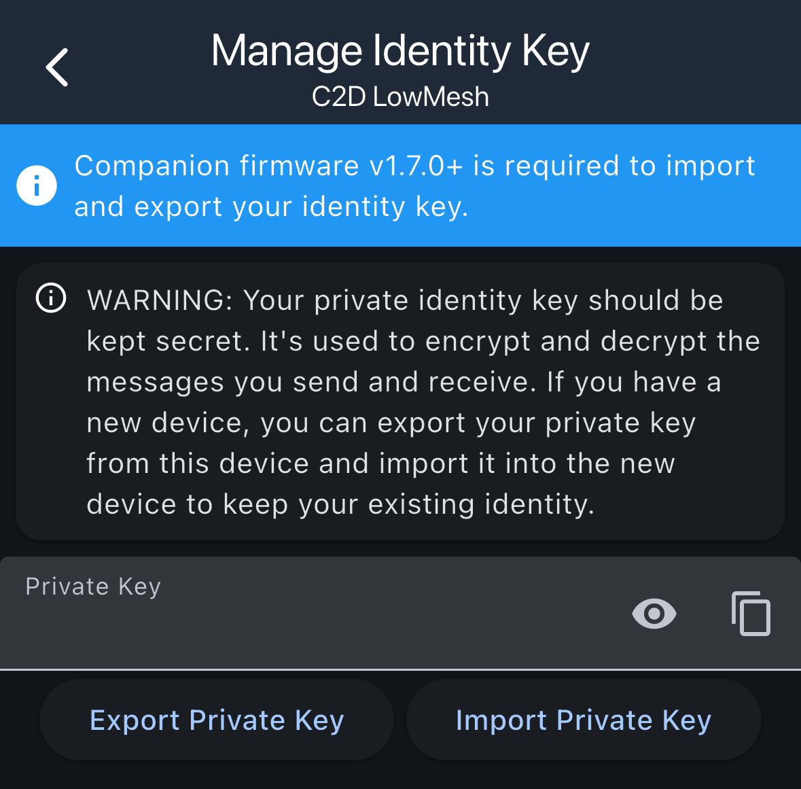
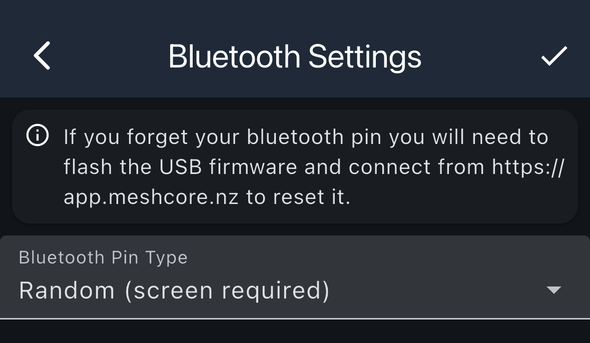
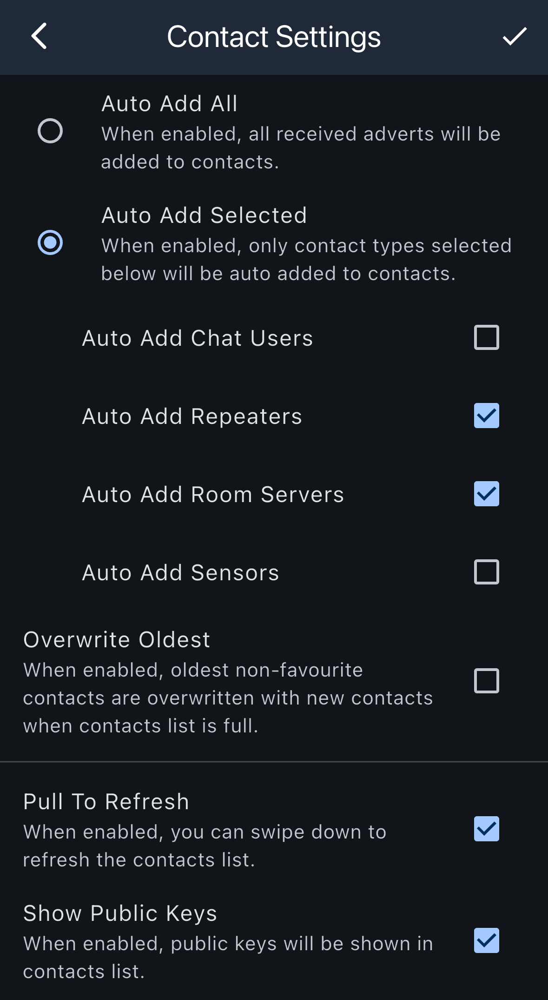
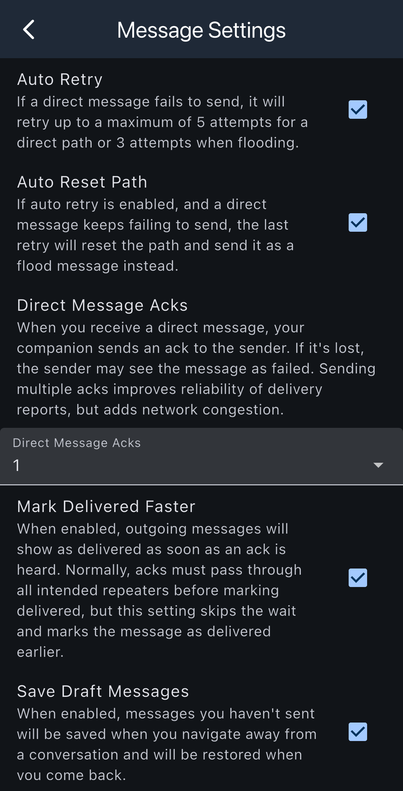
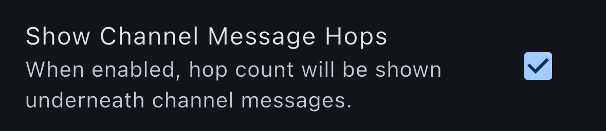
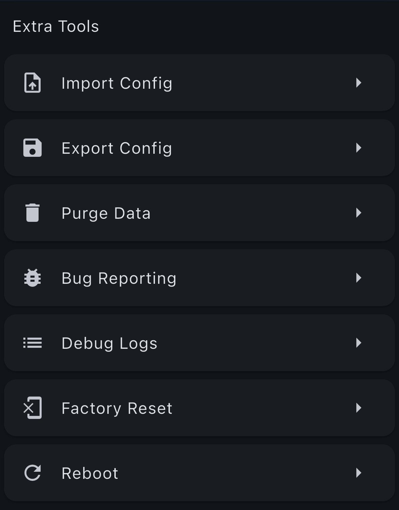
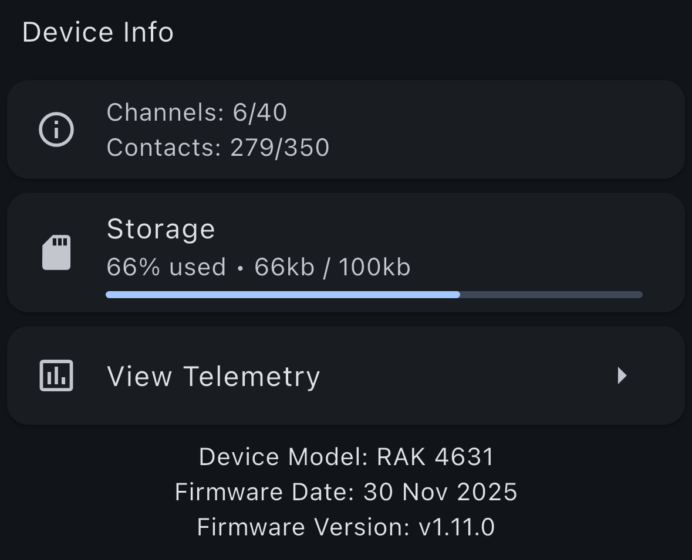

# Settings

The Settings screen allows you to configure various aspects of the MeshCore app, including your profile information, radio settings, tools, and app information.

## Name and Location

Configure your display name and location information that will be visible to other nodes on the mesh network.

To change your location, you can manually input the latitude and longitude, or tap on the map icon to pick a location on the world map.

If you want to send your location in adverts, check the box next to **Share Position in Advert**

## Radio Settings

Configure radio-related settings for your mesh node, including transmission parameters and radio-specific configurations. Refer to [Radio Settings](../radio-settings.md) for the radio settings in your region.

## Other Settings

The Other Settings section provides additional configuration options for managing your identity, Bluetooth connection, contacts, messages, and other app preferences.

### Manage Identity Key

Manage your private key, which is used to encrypt and decrypt messages. This is critical for maintaining your identity across devices.

**Important Notes:**
- Companion firmware v1.7.0+ is required to import and export your identity key
- Your private identity key should be kept secret
- The private key is used to encrypt and decrypt messages you send and receive
- If you have a new device, you can export your private key from an old device and import it into the new device to keep your existing identity

**Available Actions:**
- **Export Private Key**: Export your private key to transfer it to another device
- **Import Private Key**: Import a private key from another device
- **View Private Key**: View your private key (use the eye icon to toggle visibility)
- **Copy Private Key**: Copy your private key to the clipboard

### Bluetooth Settings

Configure Bluetooth connection settings for your companion device.

**Important Warning:**
If you forget your Bluetooth PIN, you will need to flash the USB firmware and connect from https://app.meshcore.nz to reset it.

**Settings:**
- **Bluetooth Pin Type**: Choose the type of PIN used for Bluetooth pairing (default pin is 123456)
  - **Random (screen required)**: Generates a random PIN that requires the device screen to display
  - **Custom**: Create a unique 6 digit pin for pairing

### Contact Settings

Configure how contacts are automatically added and managed in your contact list.

- **Auto Add All**: When enabled, all received adverts will be added to contacts
- **Auto Add Selected**: When enabled, only contact types selected below will be auto added to contacts
  - **Auto Add Chat Users**: Automatically add companions to contacts
  - **Auto Add Repeaters**: Automatically add repeaters to contacts
  - **Auto Add Room Servers**: Automatically add room servers to contacts
  - **Auto Add Sensors**: Automatically add sensors to contacts
- **Overwrite Oldest**: When enabled, oldest non-favourite contacts are overwritten with new contacts when contacts list is full
- **Pull To Refresh**: When enabled, you can swipe down to refresh the contacts list
- **Show Public Keys**: When enabled, public keys will be shown in contacts list

### Message Settings

Configure message delivery and retry behavior.

- **Auto Retry**: If a direct message fails to send, it will retry up to a maximum of 5 attempts for a direct path or 3 attempts when flooding
- **Auto Reset Path**: If auto retry is enabled, and a direct message keeps failing to send, the last retry will reset the path and send it as a flood message instead
- **Direct Message Acks**: When you receive a direct message, your companion sends an ack to the sender. If it's lost, the sender may see the message as failed. Sending multiple acks improves reliability of delivery reports, but adds network congestion. You can configure the number of acks to send
- **Mark Delivered Faster**: When enabled, outgoing messages will show as delivered as soon as an ack is heard. Normally, acks must pass through all intended repeaters before marking delivered, but this setting skips the wait and marks the message as delivered earlier
- **Save Draft Messages**: When enabled, messages you haven't sent will be saved when you navigate away from a conversation and will be restored when you come back
- **Show Channel Message Hops**: When enabled, hop count will be shown underneath channel messages

## Tools

Access various tools and utilities for managing your mesh node, including diagnostic tools and maintenance options.

- **Import Config**: Imports settings from a config file
- **Export Config**: Export your settings to a config file
- **Purge Data**: Deletes all contacts from your device (can preserve favourites)
- **Bug Reporting**: Sends app errors to BugSnag
- **Debug Logs**: View device firwmare debug logs
- **Factory Reset**: Erases all data from your device, reseting it to factory defaults
- **Reboot**: Rebbots device

## Info

View information about your device and the app.
