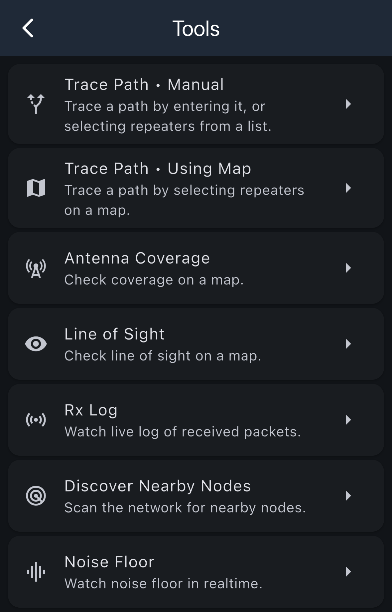

# Tools

The Tools menu provides various utilities for analyzing and managing mesh network coverage and diagnostics.

## Available Tools

### Trace Path • Manual

Trace a path by entering it manually, or selecting repeaters from a list. This tool allows you to see how strong repeaters are connected to each other by manually specifying the route by choosing specific repeaters.

### Trace Path • Using Map

Trace a path by selecting repeaters on a map. This visual tool allows you to see how strong repeaters are connected to each other by selecting repeaters displayed on a map.

### Antenna Coverage

Check coverage on a map. This tool helps you visualize the coverage area of your antenna and understand the reach of your signal across the mesh network.

### Line of Sight

Check line of sight on a map. Use this tool to determine if there's a clear line of sight between two points on a map.

### Rx Log

Watch live log of received packets. This diagnostic tool provides real-time monitoring of all packets your device receives, helping you troubleshoot connectivity and message delivery issues.

### Discover Nearby Nodes

Scan the network for nearby nodes. This tool actively searches for and discovers nodes in your vicinity, helping you identify available connections and expand your network awareness.

### Noise Floor

Watch noise floor in realtime. This diagnostic tool monitors the ambient radio noise levels in real-time, which is crucial for understanding signal quality and potential interference issues.