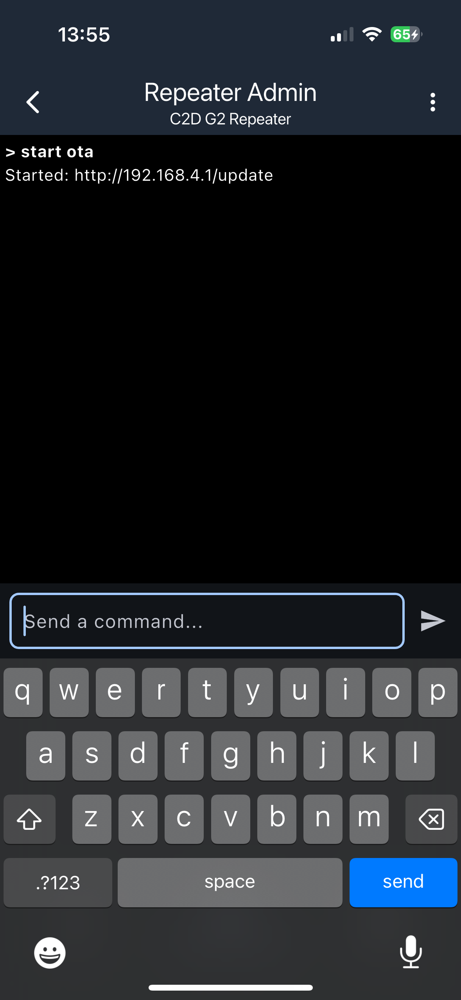
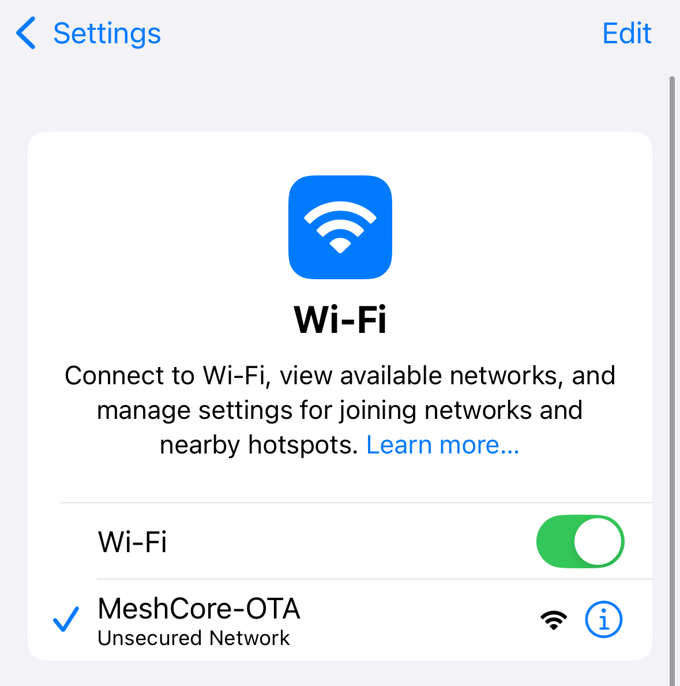
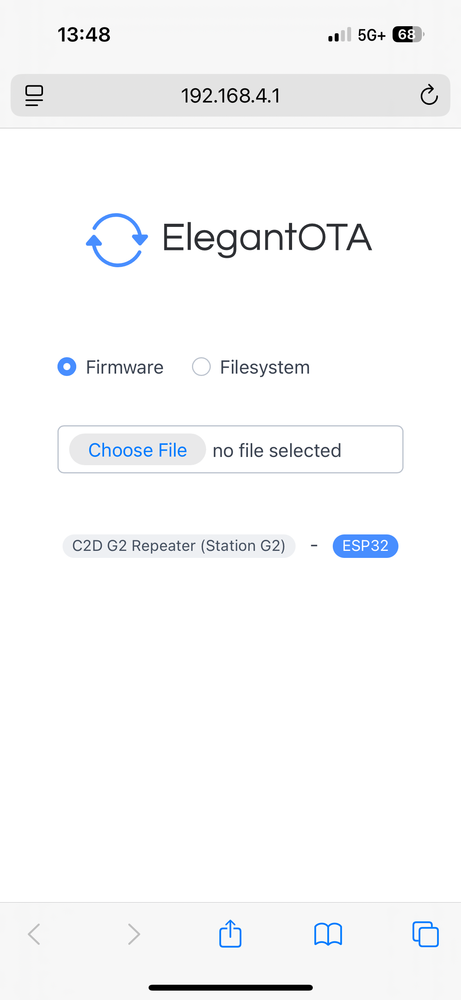

# ESP32 based boards

This HOWTO is based on a few assumptions:

- You have an ESP32 based board in need of update.
- Your ESP32 based board is running MeshCore
- Your ESP32 based board has a WiFi antennae installed.
- You have legitimate admin access for the repeater.
- You have a basic understanding of using the MeshCore app to log in to and manage a repeater.

## Prerequisites

- A MeshCore companion, in a "known/good" state for communication to your phone, and your repeater.
- A MeshCore app for connectivity to the repeater.
- Physical proximity to the repeater, as the process will be conducted over WiFi.
- A browser app, such as Chrome, pre-installed on your phone.

## Step 1: Retrieve the Firmware Update

On your phone, browse to the [MeshCore Web FLasher](https://flasher.meshcore.co.uk/)

Search for your board and select it. Select **"Repeater"** on the next page. The "Download" button has two options. Select the **non-merged .bin file** (there should not be the word "merged" in the file name), and save to your device you'll be using in the field for this update procedure.


Note what folder it saves to, you'll be uploading from there later.

## Step 2: Connect to the Repeater, and Activate Wifi

Log in to your repeater using the MeshCore app.

Select the **"Command Line"** option from the bottom of the app.

Type: `start ota` and press enter.

You should see a confirmation from the repeater, which looks like:

```
Started: http://192.168.4.1/update
```



If successful, Wifi is now active on the repeater.

## Step 3: Connecting to your repeater

Head over to your phone's Wifi settings. You will need to connect to the new network you just activated. The SSID should say **MeshCore-OTA**.



Open up your favorite browser app and type in the address that appeared when you typed `start ota`. It should be http://192.168.4.1/update



Make sure you have **Firmware** selected and then tap on **Choose File**. Browse to the location of the .bin file you saved earlier. Once you select it, the update will autmatically start. Upon successful upload the repeater should reboot, and be running the latest version, which can be verified through the MeshCore app.