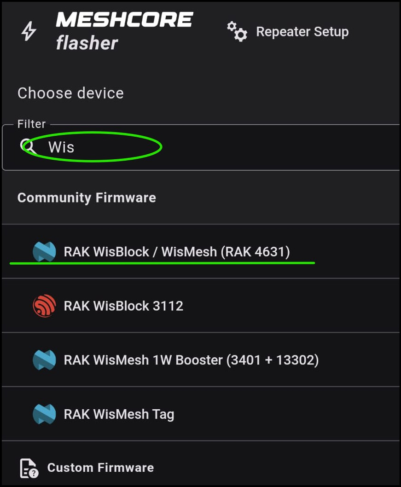
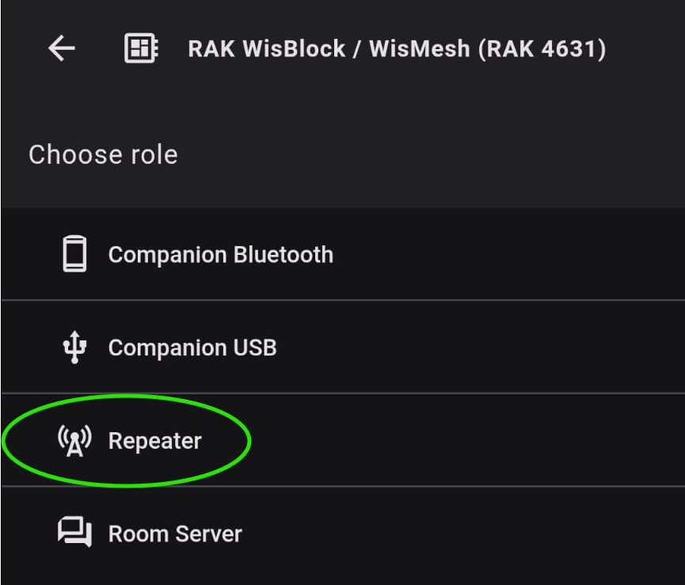
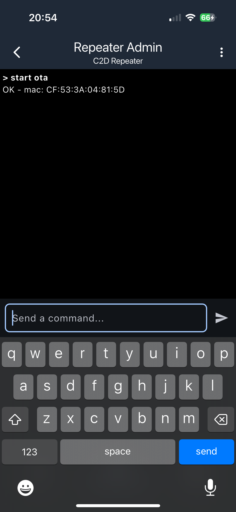
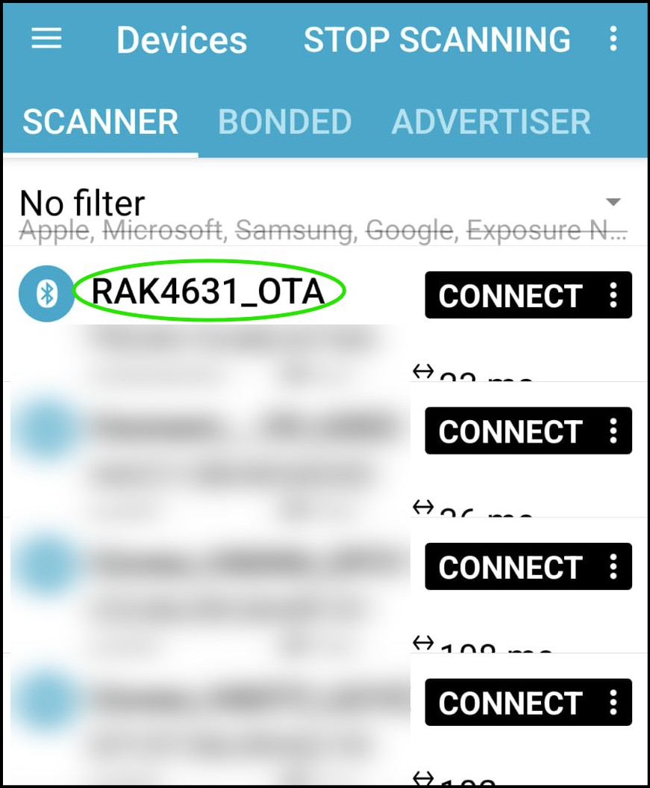
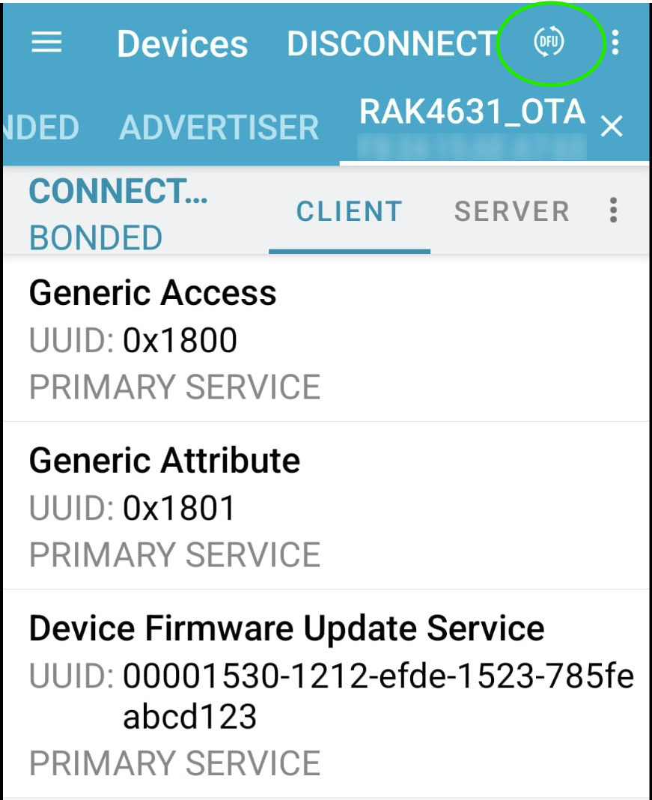
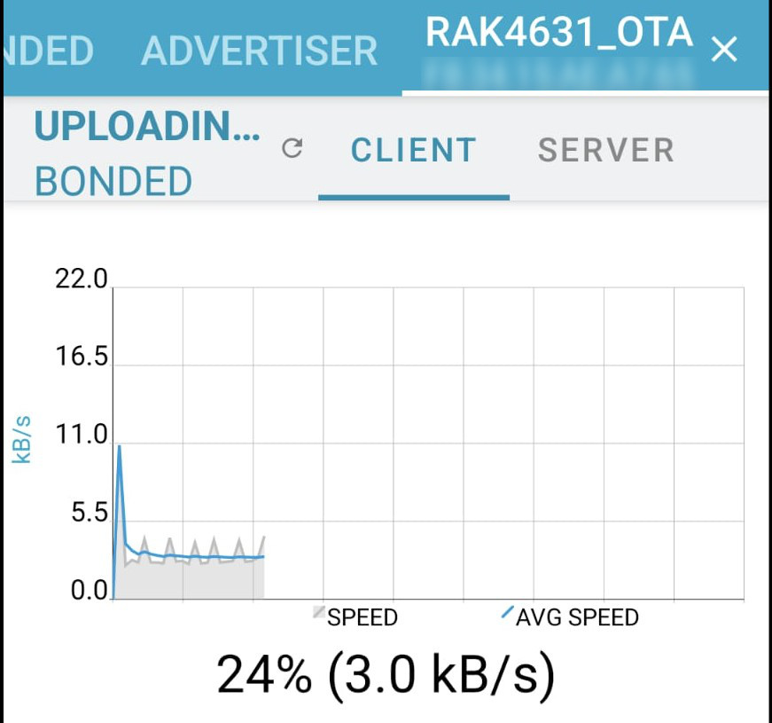
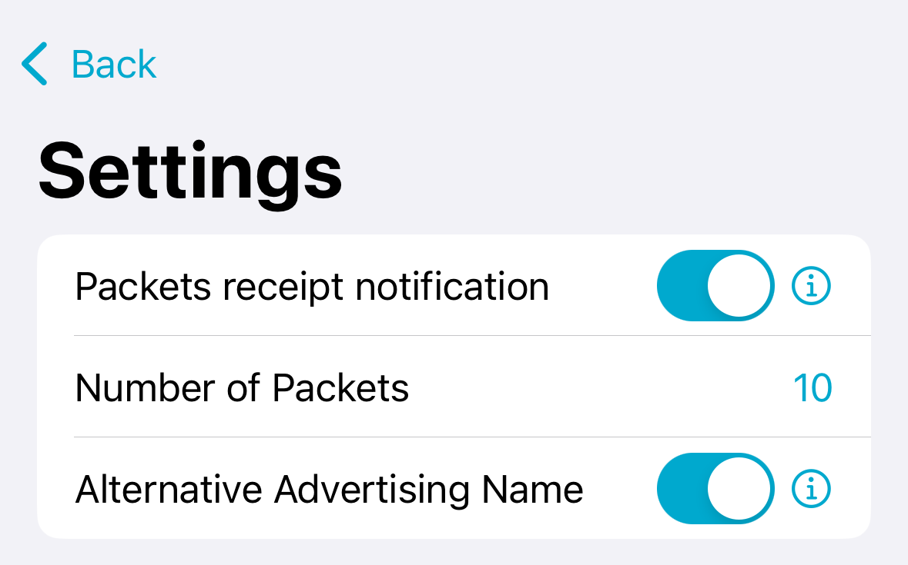
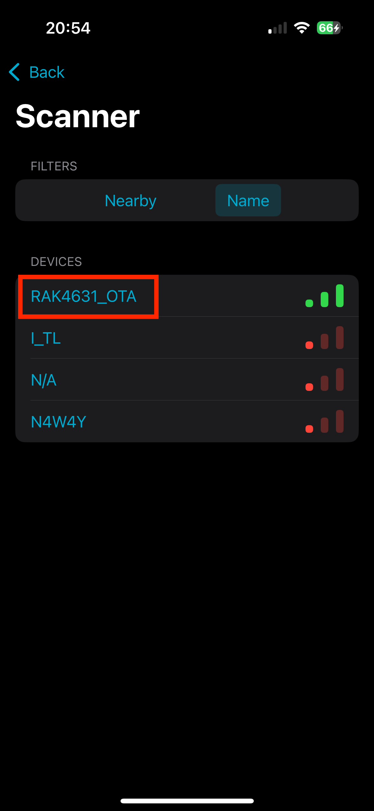
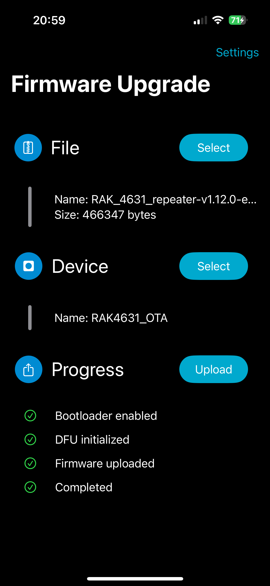

# nRF (RAK, T114, Seed XIAO) based boards

This guide was written to support the MeshCore community and close identified gaps in the procedure for OTA updates. The procedure detailed may work on other platforms. No warranties expressed or implied; updates always come with inherent risks. Your mileage may vary, void where prohibited. Not to be used for maintenance of aircraft engines. Driver carries no cash. Coffee may be hot. Safety not guaranteed.

**Author:** DroneUnit on WCMesh, https://discord.gg/wcmesh

This HOWTO is based on a few assumptions:

- You have a nRF based board in need of update.
- Your nRF based board is running MeshCore
- Your nRF based board has a BLE antennae installed.
- You have legitimate admin access for the repeater.
- You have a basic understanding of using the MeshCore app to log in to and manage a repeater.

## Prerequisites

- A MeshCore companion, in a "known/good" state for communication to your phone, and your repeater.
- A MeshCore app for connectivity to the repeater.
- Physical proximity to the repeater, as the process will be conducted over Bluetooth.
- The 'nRF Connect' or 'nRF Device Firmware Update' app pre-installed on your phone.

## Step 1: Retrieve the Firmware Update

On your phone, browse to the [MeshCore Web FLasher](https://flasher.meshcore.co.uk/)

Search for your board. In this example we will use **"RAK WisBlock / WisMesh (RAK 4631)"**.



Select **"Repeater"**.



The "Download" button has three options. Select the **.ZIP file**, and save to your device you'll be using in the field for this update procedure.


Note what folder it saves to, you'll be uploading from there later.

## Step 2: Connect to the Repeater, and Activate Bluetooth

Log in to your repeater using the MeshCore app.

Select the **"Command Line"** option from the bottom of the app.

Type: `start ota` and press enter.

You should see a confirmation from the repeater, which looks like:

```
OK – mac: xx:xx:xx:xx:xx:xx:xx
```



If successful, Bluetooth is now active on the repeater.

## Step 3: Using the nRF Apps

### Option A: nRF Connect

Open nRF Connect, and click **Scan** in the upper right. You should see any Bluetooth device in range, including your WisBlock.

Click **Connect** to the right of the WisBlock's entry.



Once connected, you should see a screen with a small button inside a circle that reads **"DFU"**, which may be difficult to see outdoors under sunlight. Tapping that will allow you to browse to the downloaded .ZIP file and select it for upload.



During upload a progress graph is displayed. Bluetooth file transfer is not expedient, this should take 2-6 minutes to complete. Upon successful upload the repeater should reboot, and be running the latest version, which can be verified through the MeshCore app.



### Option B: nRF Device Firmware Update (DFU)

Open nRF Device Firmware Update (it may also be labeled as DFU), and tap on **Settings** in the top right corner. Enable `Packets receipt notification` and change `Number of Packets` to 10 for RAK, 8 for T114.



Tap on the **Select** button next to **File**. This will allow you to browse to the downloaded .ZIP file and select it for upload.

The **Select** button next to **Device** should now be active. Tap on that to see any Bluetooth device in range, including your WisBlock. Tap on your WisBlock's name to select it.



The **Upload** button should now be enabled. Tapping that will start the update process. During upload a progress bar is displayed. Bluetooth file transfer is not expedient, this should take 2-6 minutes to complete. Upon successful upload the repeater should reboot, and be running the latest version, which can be verified through the MeshCore app.

