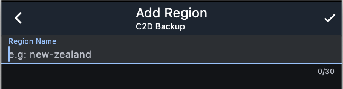
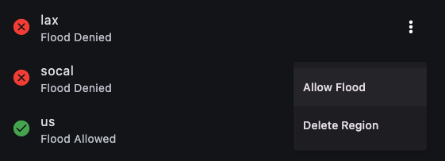
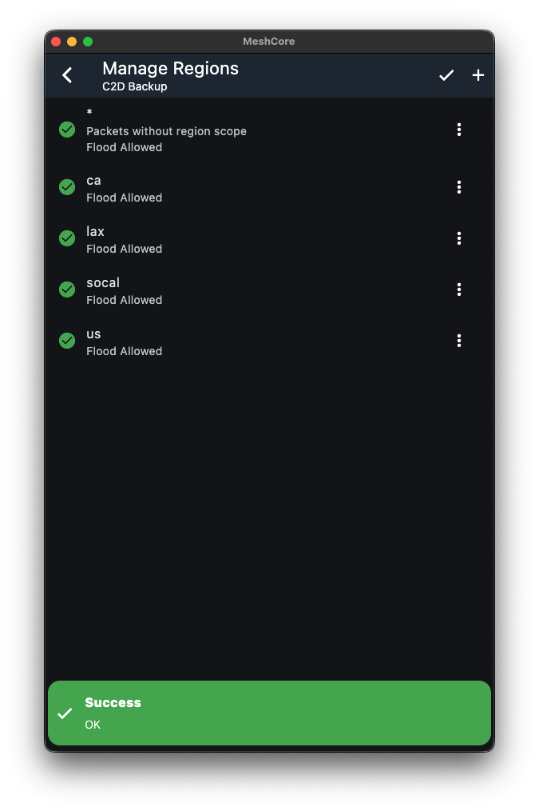

# Adding Regions to Repeaters

To forward scoped traffic, a repeater must have the right **regions** defined and **flood allowed** for each region. You can do this in two ways: via the **MeshCore app** (remote admin) or via the **CLI** (serial or remote).

For how regions and scope work, see [Region and Scope Filtering Guide](index.md).

---

## Option 1: Via remote admin

1. **Log in to the repeater** from the MeshCore app (e.g. from your contact list). Use **Log In** with your **admin** password so you have management access.

2. Tap on **Manage Regions** from the Extra Tools section on the Settings tab.

   

3. Tap the plus sign in the top right corner to **add regions**. Type the name (all lowercase) and hit the checkmark in the top right corner.

   

4. **Allow flood** for each region you want the repeater to forward. A region must be explicitly allowed for flood; otherwise scoped packets for that region are dropped. Tap the three dots next to the region name and tap Allow Flood.

   

5. **Save** the region configuration so it persists across reboots. Tap the checkmark in the top right corner.

   

---

## Option 2: Via the CLI (serial or remote)

You can use the repeater **CLI** over serial or via the app’s **Command Line** tab when logged in as admin. Full reference: [CLI – Region Management](../cli-reference.md#region-management-repeater-only).

### Add and allow a single region

No parent:
```text
region put MyRegion
region allowf MyRegion
region save
```

Parent:
```text
region put MyRegion MyParent
region allowf MyRegion
region save
```

Use your actual region name (e.g. `lax`, `socal`) instead of `MyRegion` and `MyParent`. Use `*` for a top-level region.

### Load multiple regions (with hierarchy)

Use `region load` to define several regions and their flood permissions in one go. Each line is a region name; **indentation** (spaces) sets the parent; **`F`** means flood allowed. End with a blank line.

```text
region load
* F
 us F
  ca F
   socal F
    lax F
    sd F
    oc F
   cv F
    teh F
    bfl F
```

Then persist:

```text
region save
```

### Useful commands

| Command | Purpose |
|--------|--------|
| `region` | List all regions and flood permissions (serial only) |
| `region list allowed` | List regions that have flood allowed (ver 1.12+) |
| `region put <name> [parent]` | Add or update a region |
| `region allowf <name>` | Allow flood for that region |
| `region denyf <name>` | Deny flood for that region |
| `region remove <name>` | Remove a region (no children allowed) |
| `region save` | Save region map to storage |

---

## Summary

- **App:** Log in as admin → Manage Regions → add regions → allow flood for each → check region list → save.
- **CLI:** Use `region put` and `region allowf` (or `region load` for many), then `region save`.

Only regions that **allow flood** are used for matching; packets whose scope matches an allowed region are forwarded; others are dropped. For nested regions, allow flood on each region you want to forward (children do not inherit flood permission from the parent).
