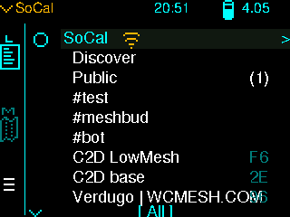
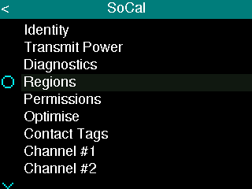
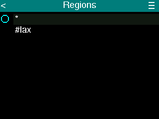
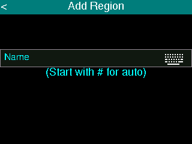
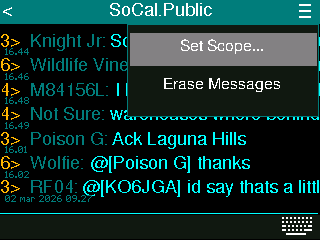
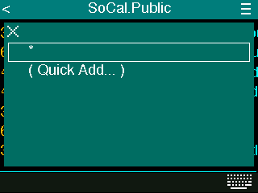

# Adding a Scope to a Channel

Setting a **channel scope** sends a transport code along with the messages in that channel. Only repeaters that allow a region that matches the scope will forward the traffic. This guide shows how to set the scope.

For how scope and regions work on the network, see [Region and Scope Filtering Guide](index.md).

---

## MeshCore app

1. **Open the channel** you want to scope (e.g. a hashtag channel).

2. Tap the **three-dots** (⋮) for that channel and choose the option set region scope.

   

3. In the **scope list**, pick the region you want for this channel. Use the **plus (+)** button if you need to add a new region first.

   

4. The channel’s scope is shown **under the channel name** in the channel view.

   

Once set, messages you send and receive in that channel use that scope. Repeaters will only forward messages if they have that region defined and **flood allowed** (see [Adding Regions to Repeaters](adding-regions.md)).

---

## Ripple UI

1. From the main screen, tap the **network name** to open network settings.

   

2. Tap **Regions** to view the region list.

   

3. You’ll see the current regions.

   

4. Tap the **hamburger menu** (☰) in the top right to **add a region**. Regions you add here can be used when setting a channel’s scope.

   

5. From the **main screen**, tap the **channel name** you want to scope.

6. Tap the **hamburger menu** (☰) in the top right.

7. Choose **Set scope** to open the scope picker.

   

8. **Choose a scope** from the list, or **add a new region** if the one you want is not listed.

   

Once set, messages in that channel use that scope. Repeaters will only forward them if they have that region defined and **flood allowed** (see [Adding Regions to Repeaters](adding-regions.md)).
