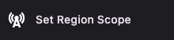
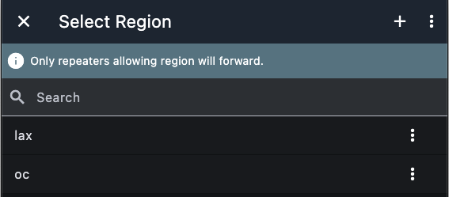

# Adding a Scope to a Channel

Setting a **channel scope** sends a transport code along with the messages in that channel. Only repeaters that allow a region that matches the scope will forward the traffic. This guide shows how to set the scope.

For how scope and regions work on the network, see [Region and Scope Filtering Guide](index.md).

---

## MeshCore app

1. **Open the channel** you want to scope (e.g. a hashtag channel).

2. Tap the **three-dots** (⋮) for that channel and choose the option set region scope.

   

3. In the **scope list**, pick the region you want for this channel. Use the **plus (+)** button if you need to add a new region first.

   

4. The channel’s scope is shown **under the channel name** in the channel view.

   

Once set, messages you send and receive in that channel use that scope. Repeaters will only forward messages if they have that region defined and **flood allowed** (see [Adding Regions to Repeaters](adding-regions.md)).
