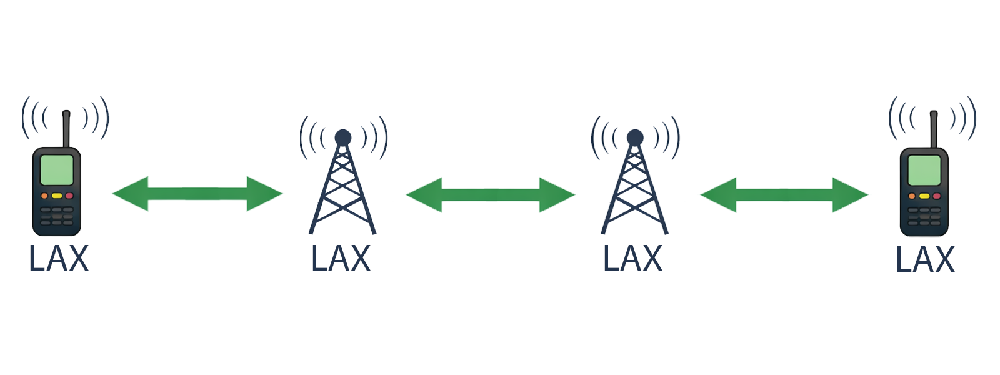
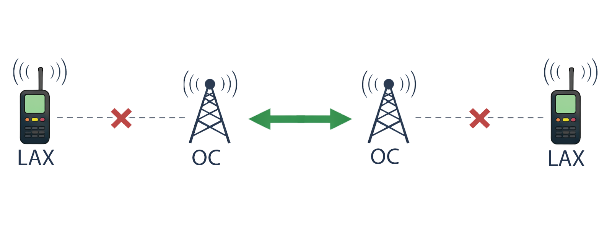
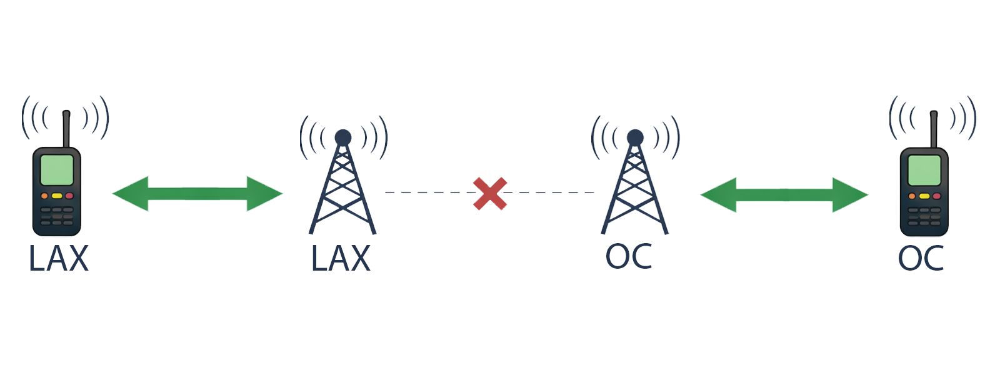
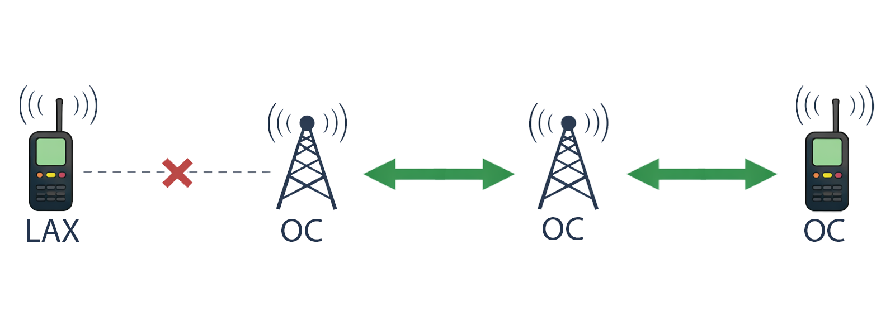

# Region and Scope Filtering Guide

This document explains how region-based filtering (scope) works in MeshCore: how packets are scoped, how repeaters allow or deny traffic by region, and how to reason about multi-repeater and multi-companion setups.

---

## How scope works on the wire

### Transport code = scope

Each flood packet can carry two 16-bit **transport codes** in the packet header. The first one is the **flood scope**: it identifies which region the packet is considered to be in.

- **Sender:** When sending with a scope (e.g. on a Companion with a channel scope set), the firmware uses a **TransportKey** tied to that region to compute a code. That code is written into the packet and sent.
- **Receiver:** A repeater reads the packet’s transport code and checks it against its **region map** to decide whether to forward or drop the packet.

So **scope** = which region’s key was used to tag the packet. Different region names (e.g. lax, oc, socal) produce different keys and therefore different codes. A packet has exactly one scope.

### Regions and allow/deny

On a repeater, each **region** has:

- A **name** (e.g. `lax`, `socal`, `*` for wildcard).
- A **TransportKey** derived from that name (e.g. hash of the name for public/hashtag regions).
- **Flags:** in particular `REGION_DENY_FLOOD`. If set, that region is **denied** (no flooding); if clear, it is **allowed**.

Contrary to what you may think, the **wildcard** region `*` applies to packets that have **no** transport codes (plain flood, no scope), not **all** transport codes. All other traffic is matched by comparing the packet’s transport code to the keys of **allowed** regions only.

### Matching on the repeater

When a flood packet arrives, the repeater:

1. **Classifies it**:
   - If the packet has transport codes, it tries to find a match in the region map.
   - Finding a match only considers regions that **allow** flood. The first region whose key matches is the “matched” region. If none match, the result is “no region.”
   - If the packet has no transport codes (plain flood), the packet is treated as wildcard `*`; allow/deny is determined by the wildcard’s flags.

2. **Decides whether to forward**:
   - If the packet is flood and the matched region is “none” (unknown scope or only denied regions), the repeater **drops** the packet.
   - Otherwise it may forward (subject to other rules like path length, etc.).

So: **a repeater only forwards a packet if the packet’s scope matches an allowed region on that repeater.** Different scopes (lax, oc, socal, etc.) are independent: each scope is either allowed or denied per region.

---

## Nested regions and home region

### Data model

- Regions are stored in a **RegionMap**. Each region has an **id**, **name**, **flags** (allow/deny), and a **parent** id (0 = wildcard `*`). The tree is flat in storage; hierarchy is only the parent link.
- One region can be designated **home** for the node. This is used for display (e.g. `region home`, `^` in region list) and is intended for future use; it does **not** currently affect forwarding on repeaters.

### Nested regions (parent/child)

- **Creation:** Use `region put <name> [parent_name]` or `region load` with indented lines. Indent level (number of leading spaces, max 8) sets the parent: e.g. one space = child of wildcard, two spaces = child of the previous one-space region, etc.
- **Removal:** A region cannot be removed if it has children. Remove from the leaves up (e.g. lax, then socal, then ca).
- **Flags are per region:** Allow/deny is stored per region. The code does **not** “inherit” flood permission from parent to child. To allow a child, you must allow that child (e.g. `region allowf LAX` or `F` on that line in `region load`).

So the hierarchy is for **organization and display** only. Filtering is per region name (per transport key), not “parent allows so child is allowed.”

### Home region

- **Set:** `region home <name>`
- **Read:** `region home`
- **Effect today:** Stored and shown in CLI and in the region tree (`^`). Not used for forwarding or for choosing send scope yet (those are planned).

---

## Repeater regions and companion scopes

### Multiple regions allowed

A packet’s single transport code is compared against each allowed region’s key; the first match wins.

If you want a repeater to forward traffic:

- Create and allow the region (e.g. `region put lax`, then `region allowf lax`).
- Packets with the scope will match and be forwarded; packets with any other scope will not match and will be dropped.
- You can set up hierarchy (e.g. `region put socal`, then `region put lax socal`).
- Matching a scope only considers regions that **allow** flood.

### One scope per packet

- Each companion sends (and receives) with a **channel scope** (e.g. lax or oc). That scope fixes the transport code on every packet it sends.
- A packet has **one** scope. It does not belong to “lax and oc” at once.

---

## Examples

### Scope matches region

**Companion A** can send messages to **Companion B** because both have the same scope and the repeaters in their path have a region that matches the scope.

### Different scopes and regions

**Companion A** cannot send messages to **Companion B** because there are no repeaters in their path where the region matches the scope.

**Companion A** cannot send messages to **Companion B** because there are no repeaters in their path where the regions match.

**Companion A** cannot send messages to **Companion B** because they are using different scopes and there is no repeater that matches Companion A's scope.

---

## Summary table

| Question | Answer |
|----------|--------|
| What is “scope”? | The transport code on the packet. One scope per packet. |
| Who sets scope? | The sender (e.g. Companion channel scope). Repeaters only filter by it. |
| How does a repeater filter? | It only forwards if the packet’s scope matches an **allowed** region. Denied regions are not used for matching. |
| Only one scope needed? | Create and allow only that region (e.g. lax). No need to create parent regions. |
| Multiple regions allowed | Repeater forwards traffic for any of those scopes (each packet still has one scope). |

For CLI details (region put, allowf, denyf, home, load, save, etc.), see [CLI Commands – Region Management](../cli-reference.md#region-management-repeater-only).
