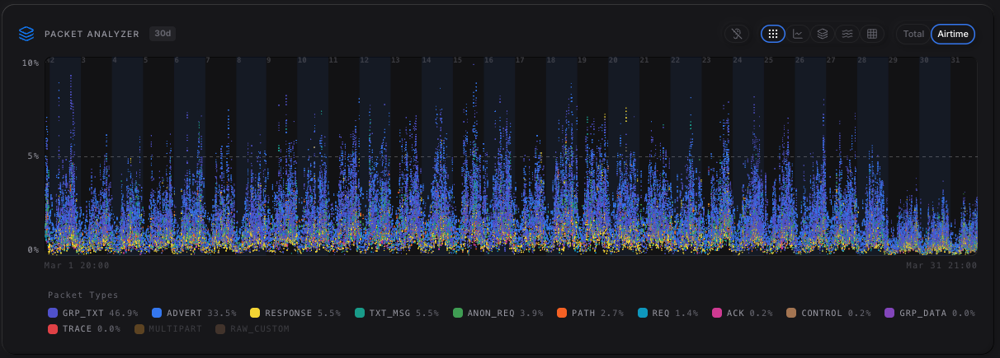
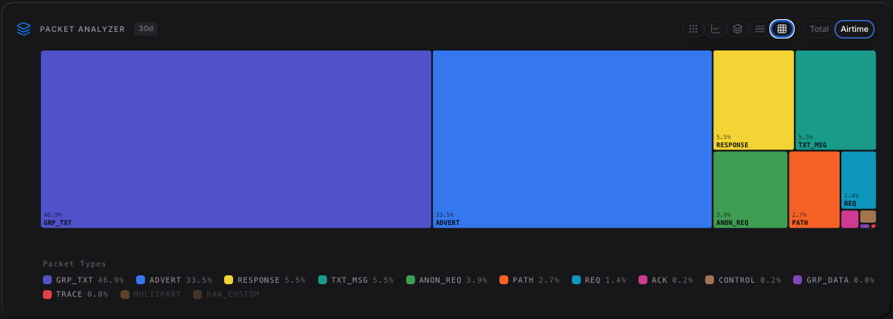
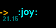
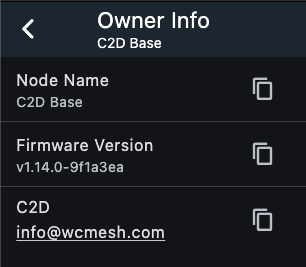
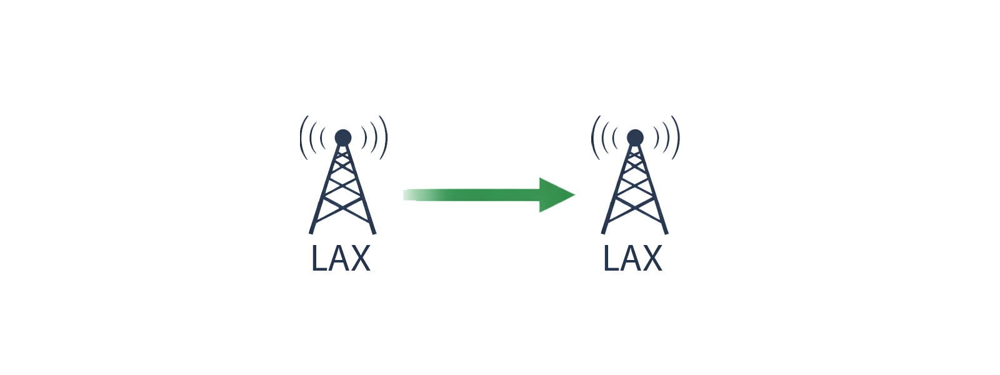
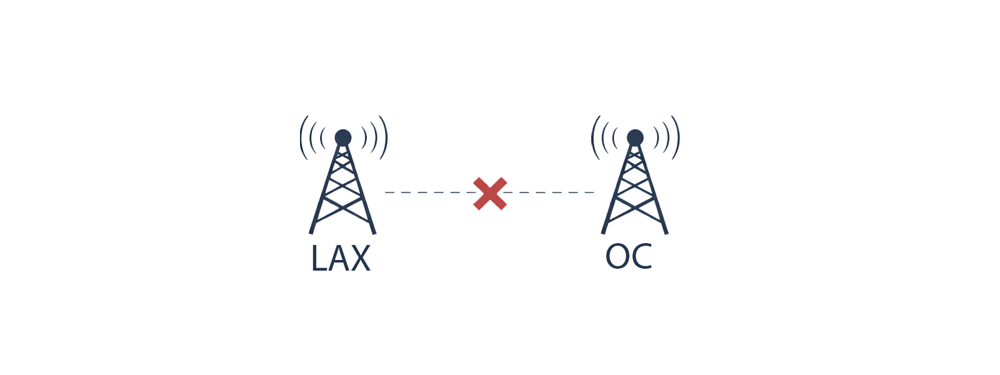
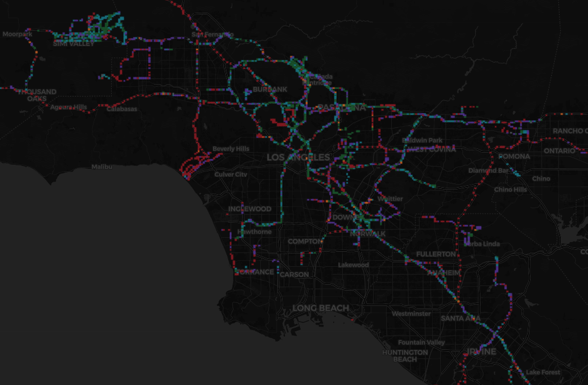
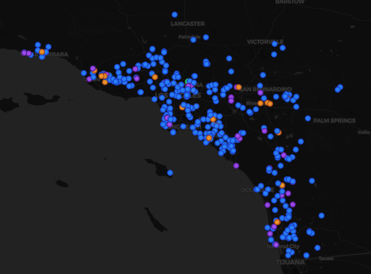

# State of the Mesh
4/12/2026

Thank you all for attending. I just wanted to get a little something together to show some mesh stats and talk about new mesh features. First, I want to say ***Thank You All*** for putting in effort to contribute to this mesh. We could not have gotten this big without all the work each and every one of you have done.

:::note
*The following is not a definitive stance of the mesh. We are a community. Not a single person can police the mesh. All topics are open to discussion.*
:::

Now onto some stats.

## Packet airtime

*Airtime utilization as seen at my location, using pyMC Console*

Around 20% airtime utilization is the limit of when packets start to break down. We would like to stay below that, which we are, mostly hovering around 10%, and we have a decent size mesh. Obviously GROUP_TEXT packets (any channel message on the mesh) is the most common type, followed by ADVERTs.

Here is a breakdown of the packet types:

| Packet| Description |
| --- | --- |
| GRP_TEXT | Channel (public or private) messages |
| TXT_MSG | Peer to peer message: DMs, cli commands |
| ADVERT | Notifies receivers that a node exists, and gives information about the node |
| ACK | An acknowledgement that a message was received |
| PATH | Path route a packet took from the original author |
| REQ | Requests to a known node (logged in as admin) |
| ANON_REQ | Requests to a node when not logged in (log in attempt, status, owner info, telemetry) |
| REPSONSE | Node response to requests or anon requests |
| CONTROL | Discovery requests |
| TRACE | Trace routes |
| GRP_DATA | Not handled |

Before, when adverts were set to 6-12hrs, they were the most common packet type on the mesh. Keeping those to **24-48h** (I prefer 47h) helps limit airtime. Direct adverts I would keep at **0**, since the parameter is set to minutes, even the max 240 is too much airtime.

For this first quarter of 2026, Jan - Mar, looking at GRP_TEXTs, we were averaging 1,162 messages a day. We averaged 304 Public channel messages, 485 test/bot channel messages (sending a bot command, getting a response, and general chit chat within the channels), and 416 wardrive pings. Obviously in an emergency, I don’t think anyone would wardrive, so having those messages flood the mesh helps test the resiliance of our mesh. A typical user doesn’t send a message every 30s or so for a few minutes, so I’m not too worried about those pings. If it does become too much, we can discuss how to handle wardriving later.

| 1/1-3/31 | Avg/Day | /Week | /Month |
| --- | --- | --- | --- |
| All GRP_TEXT | 1,162 | 6,970 | 30,202 |
| Public | 304 | 1,822 | 7,895 |
| Tests/bots | 485 | 2,881 | 12,485 |
| Wardrive | 416 | 2,391 | 9,821 |

## Mesh Changes/Guidelines?

### RippleUI

Since people use RippleUI on the T-Deck, should we make certain channels conform to be Ripple firendly? Ripple has a limit of 10 characters for channel names, which is why **#socal-incidents** turned into **#socalalert**. **#emergency**, **#test**, and **#meshbud** all still work on Ripple. RippleUI also starts to look weird when repeater names are longer than 20 characters. Not a big deal but could be annoying to some users. The major thing, though, is emojis. Prior to v9.2, emojis could not be rendered on RippleUI. Now they show up as **:emoji name:**, but you can’t send emojis.

### Repeater updates

#### path.hash.mode
The new command **path.hash.mode** only affects *originating* packets. Setting **path.hash.mode** on repeaters only affects its adverts, as those are the only packets that *originate* from repeaters. Your repeater will still forward *all* traffic, regardless of what hash mode it is set to, so feel free to change it to 2 or 3 byte mode (remember the parameter 0 = 1 byte, 1 = 2 byte, 2 = 3 byte). Once we see enough repeaters are on 2 byte, we will tell you all when you can switch companions over to 2 byte. Command `set path.hash.mode {0|1|2}`

#### loop.detect
A new cli command **loop.detect** was introduced in 1.14.0. Setting it will change how a repeater rejects flood packets which look like they are in a loop. Example: If preference is **loop.detect minimal**, and a 1-byte path size packet is received, the repeater will see if its own ID/hash is already in the path. If it's already encoded **4** times, it will reject the packet. If the packet uses 2-byte path size, and repeater's own ID/hash is already encoded **2** times, it rejects. If the packet uses 3-byte path size, and the repeater's own ID/hash is already encoded **1** time, it rejects. I would suggest setting **loop.detect** to **minimal**. Command `set loop.detect {off|minimal|moderate|strict}`

| State	| 1 byte | 2 byte | 3 byte |
| --- | --- | --- | --- |
| minimal | ≥ 4 | ≥ 2 | ≥1 |
| moderate | ≥ 2 | ≥ 1 | ≥ 1 |
| strict | ≥ 1 | ≥ 1 | ≥ 1 |

#### owner.info
We should start setting **owner info** on our repeaters. If you monitor and are on mesh 24/7, you can set the owner info to your on mesh node name. If you are only on mesh for a few hours a day and don't see all the messages, but are on Discord, you can put your Discord name. If you are not on Discord, or never check your messages, and aren’t on mesh a lot, please provide some other contact method, be it an email or phone number, so if some other person on the mesh detects problems with your repeater, we can easily contact you. Command `set owner.info {text}`. `|` will be translated to new line. Example: `set owner.info C2D|info@wcmesh.com` will result in the image below.

#### Region/Scope
There has been some talk about setting regions, however, I don’t think it works with our mesh right now. Currently, companions accept all messages, regardless of scope. There is no filter within the code yet, even though you can set scopes on channels. Its a kin to hash.mode where a scope sets a transport code on packets to tell repeaters which messages should be forwarded or not. The repeaters need to have a matching region for the scope in order to forward the packet. If we bridge with other regions in the future, we may need to implement regions. We can discuss if we want to implement this or not.

### Wardriving
I think I will have everyone move to [MeshMapper](socal.meshmapper.net). The current coverage.wcmesh wardrive is not being developed anymore and I don’t have time to update it. The team over at MeshMapper have done amazing work on adapting multibyte and since it’s pretty fresh, it won’t have a lot of stale, old tiles. It has a standalone [iOS](https://apps.apple.com/us/app/meshmapper/id6758073991) and [Android](https://play.google.com/store/apps/details?id=net.meshmapper.app) app, or you can use the [browser](https://wd.meshmapper.net) like we used to do. There is a lot of information about MeshMapper, so if you want to find out more about it, feel free to contact me.

### Discord reservations
MeshBuddy’s reservation list on Discord needs to be pruned. There are several reservations that have been sitting for months with no repeaters deployed (I am guilty of one). I think we need to implement a time limit on reservations. Of course, 2 byte mode will free up a lot of space, but there are reservations taking up prefixes that could have been used already.

Also, I am not your repeater’s prefix keeper. If you own a repeater, it is up to you to maintain it if you want to keep your prefix saved on the list. I can’t keep reserving a prefix while your node goes down, that is on you. There are also several people not on Discord so they don’t know about the collision issue or how to handle them. Not having repeaters in your contacts does not affect how your messages get on the mesh. It is used to link a name to a prefix if you look at paths. If you send a ping, it may not know which one you meant to use.

We could not have gotten this far without all you who have schlepped equipment up mountain sides, slapped a node on containers, or just adding an antenna to your house/apartment. When we started in late July last year, I thought to myself, where should I add the next node? But then I realized that people will come and build it, and it shouldn’t be left to just 5 guys building the whole mesh. For that, I truly appreciate all the hardwork everyone has put into creating the network that exists today.

I want to leave with just one final note:

***Upgrade!***

## tl;dr
1. Upgrade to 1.14.1
2. `set path.hash.mode {1|2}` on repeaters only
3. `set loop.detect {minimal|moderate|strict}`
4. `set owner.info {text}`
5. Wardrive using [MeshMapper](socal.meshmapper.net)